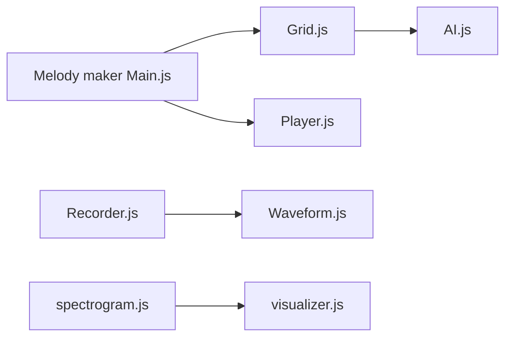

# googlecreativelab/chrome-music-lab

> Code source d'expériences musicales web de Google, archivé, utile comme référence Web Audio.

## Le problème
Apprendre la musique ou le son par la manipulation, et disposer d'exemples de code Web Audio.

## Ce que ça fait vraiment
Collection d'expériences indépendantes dans le navigateur : arpèges, accords, éditeur de mélodie avec IA de grille, piano roll, enregistrement micro et Soundspinner, spectrogramme avec visualiseur 3D, cordes et harmoniques, ondes sonores. Technologies citées : Web Audio API, WebRTC, WebMIDI, Tone.js. Chaque dossier a son propre README.

## Comment c'est branché


## Essayer
```bash
# Aucune commande dans ce README : voir le README de chaque dossier d'expérience.
```

## Coût et pièges
Gratuit. Dépôt archivé, dernier push en février 2024, README court : il faut ouvrir chaque expérience pour savoir la construire.

## Ce que ce n'est pas
Pas une application unique ni une bibliothèque réutilisable : une collection de démos.

## Alternatives
Aucune alternative nommée ; Tone.js est cité comme brique utilisée.

## Pour toi
À ignorer : archive de démos web sans lien avec ton métier, consultable seulement pour s'inspirer de Web Audio.

