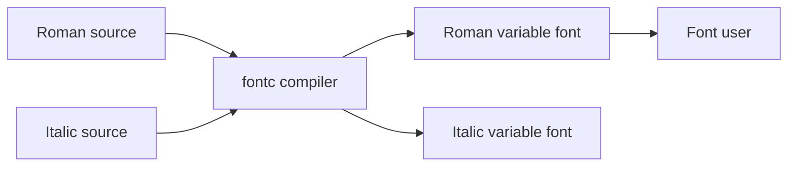

# googlefonts/googlesans-code

> Famille de polices à chasse fixe pour le code, en fontes variables Roman et Italique.

## Le problème
Les éditeurs et terminaux ont besoin d'une police où chaque caractère reste distinct même en petite taille.

## Ce que ça fait vraiment
Fournit les sources Glyphs et les fontes variables compilées (axe de graisse de 300 à 800), avec jeux stylistiques et formes localisées OpenType, pour le latin étendu. Compilation via `fontc` à partir des paquets `.glyphspackage` ; CI qui compile et teste chaque push.

## Comment c'est branché


## Essayer
```shell
git clone https://github.com/googlefonts/googlesans-code.git
fontc sources/GoogleSansCode.glyphspackage --flatten-components --decompose-transformed-components --output-file fonts/variable/GoogleSansCode[MONO,wght].ttf
```

## Coût et pièges
Gratuit, licence OFL-1.1. Pour compiler, utiliser la version de `fontc` indiquée dans `requirements.txt`.

## Ce que ce n'est pas
Pas un outil logiciel : c'est une police. Latin étendu seulement.

## Alternatives
Aucune alternative nommée dans le README.

## Pour toi
À surveiller : une police de code de plus à essayer dans ton éditeur, sans enjeu technique ; télécharge la release plutôt que de compiler.

