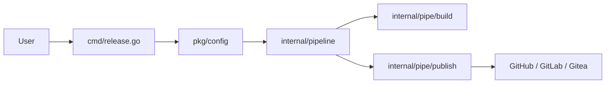

# goreleaser/goreleaser

> Outil en ligne de commande qui automatise la publication de versions logicielles, surtout Go.

## Le problème
Publier une version (binaires multiplateformes, archives, signatures, dépôts de paquets) demande des scripts fragiles.

## Ce que ça fait vraiment
Le README est très court : il ne détaille rien. D'après le code, une CLI lit un YAML et enchaîne des « pipes » (build, archive, checksums, changelog, signature, publication, annonce). Des constructeurs existent pour Go, Rust, Zig, Deno, Poetry, et des clients pour GitHub, GitLab, Gitea. Sous-commandes : `build`, `check`, `release`, `publish`, `announce`, `healthcheck`, `init`, `mcp`.

## Comment c'est branché

## Essayer
Aucune commande dans le README : la documentation est sur goreleaser.com.

## Coût et pièges
Publie vers des services tiers : jetons GitHub ou GitLab et registres à préparer. Toute la documentation est hors dépôt.

## Ce que ce n'est pas
Ce n'est pas un outil d'intégration continue : il s'y branche. Le README ne dit rien de l'installation ni des options.

## Alternatives
Aucune alternative nommée (README quasi vide).

## Pour toi
À surveiller : utile si tu distribues des outils Go en binaire ; matière trop courte pour dire plus, hors besoin en Python.

