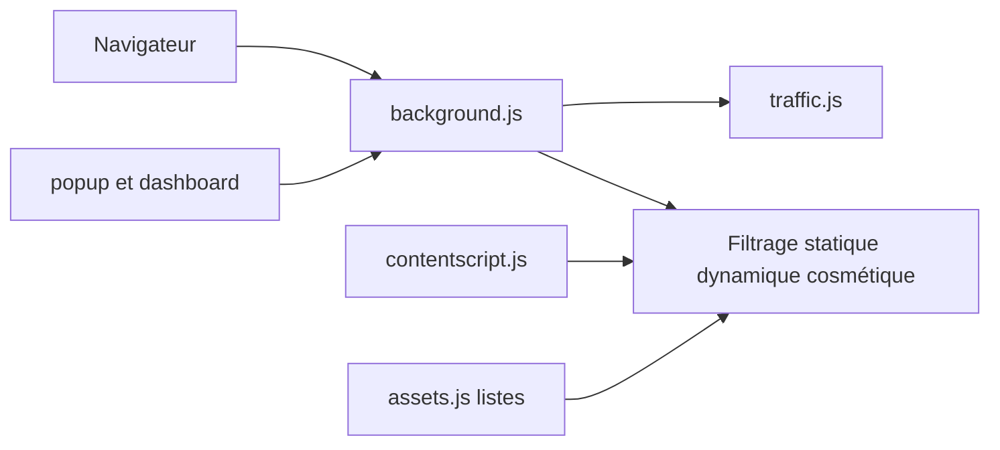

# gorhill/uBlock

> Bloqueur de publicités, traceurs et sites malveillants pour Firefox et Chromium, léger en CPU et mémoire.

## Le problème
Les pages web embarquent publicités, traceurs et scripts intrusifs qui ralentissent la navigation et exposent la vie privée.

## Ce que ça fait vraiment
uBlock Origin applique des listes de filtres (EasyList, EasyPrivacy, listes de malwares, syntaxe étendue) via des moteurs statiques, dynamiques, cosmétiques et de scriptlets, avec un mode avancé à pare-feu par site. Une version MV3 a ses propres jeux de règles. Le README précise que le blocage n'est pas du vol et que la distribution évolue.

## Comment c'est branché

## Essayer
Aucune commande documentée : installer depuis les modules complémentaires Firefox ou Edge, ou depuis la page des versions GitHub (installation manuelle).

## Coût et pièges
Gratuit, aucun don sollicité. Le Chrome Web Store a retiré l'extension le 2026-08-31 : sur Chromium, installation manuelle sans mise à jour automatique. Ne pas combiner avec un autre bloqueur.

## Ce que ce n'est pas
Ce n'est pas un outil de sécurité d'entreprise ; le README indique qu'il fonctionne mieux sur Firefox. Licence GPL-3.0 (copyleft), sans effet pour un usage personnel.

## Alternatives
Aucune alternative nommée dans le README (comparaison avec Adblock Plus pour les listes par défaut).

## Pour toi
Adopter : réduit les traceurs et les charges inutiles pendant tes recherches, à installer sur Firefox de préférence.

