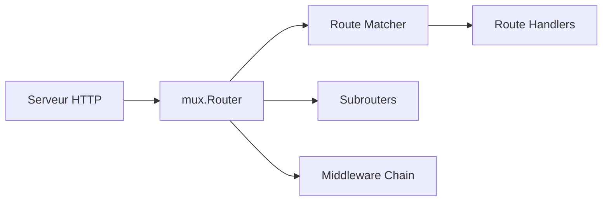

# gorilla/mux

> Routeur HTTP pour Go compatible `http.Handler`, pour qui écrit des API et des services web en Go.

## Le problème
Le multiplexeur standard de Go route mal par hôte, méthode, variables d'URL ou expression régulière.

## Ce que ça fait vraiment
`mux.Router` compare chaque requête à des routes enregistrées dans l'ordre : chemin, préfixe, hôte, schéma, en-têtes, valeurs de requête, méthodes ou matcher personnalisé. Les variables (`{id:[0-9]+}`) se lisent via `mux.Vars()`. Les routes nommées se « renversent » en URL, les sous-routeurs regroupent des conditions communes, `Use()` ajoute des middlewares et `CORSMethodMiddleware` fixe l'en-tête des méthodes autorisées.

## Comment c'est branché


## Essayer
```bash
go get -u github.com/gorilla/mux
```
Le README enchaîne des exemples Go (`mux.NewRouter()`, `r.HandleFunc(...)`) non reproduits ici.

## Coût et pièges
Gratuit, sans dépendance externe déclarée. Dernier push le 2024-08-15, soit plus d'un an : à vérifier avant un nouveau projet. Il ne gère pas les autres en-têtes CORS.

## Ce que ce n'est pas
Pas un framework web complet : ni validation, ni ORM, ni templates.

## Alternatives
Aucune alternative citée dans le README (seul `http.ServeMux` sert de référence).

## Pour toi
Surveiller : pertinent seulement si tu sers des modèles derrière une API Go ; l'inactivité récente invite à comparer avant d'en dépendre.

