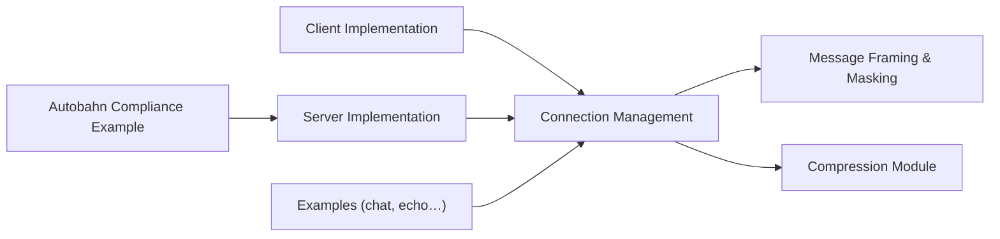

# gorilla/websocket

> Implémentation du protocole WebSocket en Go, pour qui écrit des serveurs ou clients Go.

## Le problème
Go n'offre pas de WebSocket complet dans sa bibliothèque standard.

## Ce que ça fait vraiment
Fournit une implémentation du protocole (client, serveur, compression, masquage, messages préparés). Le README affirme une API stable et le passage des tests serveur de l'Autobahn Test Suite. Le dépôt propose des exemples : chat, commande, écho, surveillance de fichiers, client/serveur.

## Comment c'est branché


## Essayer
```bash
go get github.com/gorilla/websocket
```

## Coût et pièges
Gratuit. Dernier push le 2025-03-19, soit plus d'un an : vérifier l'état du suivi des issues (82 ouvertes) avant d'en faire une dépendance.

## Ce que ce n'est pas
Ce n'est pas un framework de messagerie : pas de salles, ni de reconnexion, ni de persistance. Il ne couvre que le protocole.

## Alternatives
Aucune alternative nommée dans le README.

## Pour toi
Surveiller : sert seulement si tu exposes un service Go en WebSocket (streaming d'inférence, par exemple) ; l'activité récente est faible.

