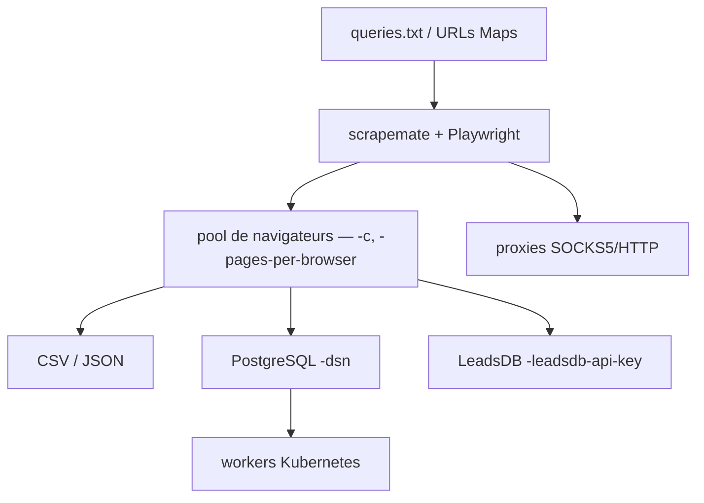

# gosom/google-maps-scraper

> Extracteur de fiches Google Maps en CLI, UI web et API REST, sous licence MIT.

## Le problème
Constituer une liste d'entreprises locales avec téléphone, site, avis et coordonnées se fait à la main ou passe par un service facturé à la ligne.
Les API SERP commerciales coûtent vite plus cher que le besoin.

## Ce que ça fait vraiment
À partir d'un fichier de requêtes (ou d'URLs Google Maps directes), il extrait 36 champs par fiche : titre, catégorie, adresse, horaires, site, téléphone, note, nombre d'avis, latitude/longitude, place_id, avis étendus.
L'option `-email` visite les sites des entreprises pour y récupérer des adresses e-mail ; `-extra-reviews` pousse jusqu'à ~300 avis.
Quatre interfaces : CLI vers CSV/JSON, UI web sur 8080, API REST (OpenAPI 3.0.3) pour créer et suivre des jobs, édition SaaS auto-hébergée multi-utilisateurs.
Le passage à l'échelle se fait par PostgreSQL : un `-produce` sème les jobs, des scrapers les consomment depuis plusieurs machines ou un Deployment Kubernetes.

## Comment c'est branché


## Essayer
```bash
mkdir -p gmaps-output
docker run \
  -v gmaps-playwright-cache:/opt \
  -v "$PWD/example-queries.txt:/queries.txt:ro" \
  -v "$PWD/gmaps-output:/out" \
  gosom/google-maps-scraper \
  -input /queries.txt -results /out/results.csv -depth 1 -exit-on-inactivity 3m
```

## Coût et pièges
Gratuit et MIT, mais Playwright est gourmand : ~120 fiches/minute à `-c 8`, et le navigateur headless demande CPU et RAM (512 Mi minimum dans l'exemple Kubernetes).
Des statistiques d'usage anonymes sont envoyées par défaut — `DISABLE_TELEMETRY=1` pour couper. Le README avertit que le scraping non autorisé peut violer des CGU.

## Ce que ce n'est pas
Ce n'est pas un produit neutre : le README est largement occupé par des encarts sponsors de proxys, avec codes promo. Le « fast mode » est en bêta et se fait bloquer.
`-resume` ne marche qu'avec une sortie fichier — pas avec stdout, plugin, LeadsDB ni fast-mode.

## Alternatives
- `omkarcloud/google-maps-scraper` : cité comme inspiration pour l'extraction JS.
- `scrapemate` : le framework de crawl sous-jacent, si tu veux écrire ton propre extracteur.
- LeadsDB : le service compagnon payant, pour la déduplication et le stockage des leads.

## Pour toi
Solide techniquement, mais le sujet (prospection, e-mails) et les sponsors proxy demandent de savoir ce que tu fais du résultat.
