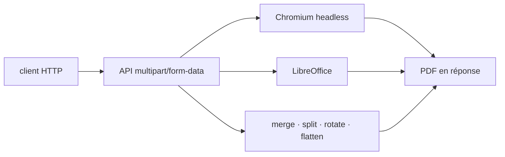

# gotenberg/gotenberg

> API Docker de conversion de documents en PDF, pilotée par requêtes multipart/form-data.

## Le problème
Convertir HTML ou bureautique en PDF oblige à installer et maintenir Chromium, LibreOffice et les
polices sur chaque machine qui en a besoin.

## Ce que ça fait vraiment
Un conteneur expose une API : tu envoies tes fichiers en `multipart/form-data`, tu récupères un PDF.
Il convertit HTML, URL et Markdown via Chromium headless, et les documents bureautiques (plus de
100 formats) via LibreOffice. Il fusionne, découpe, pivote et aplatit des PDF, applique filigranes,
tampons et chiffrement, produit du PDF/A et du PDF/UA, capture des captures d'écran d'URL et de HTML,
et lit ou écrit métadonnées et signets.

## Comment c'est branché


## Essayer
```bash
docker run --rm -p 3000:3000 gotenberg/gotenberg:8
curl \
  --request POST http://localhost:3000/forms/chromium/convert/url \
  --form url=https://sparksuite.github.io/simple-html-invoice-template/ \
  -o invoice.pdf
```

## Coût et pièges
Gratuit. Il faut Docker et de la mémoire : le conteneur embarque Chromium et LibreOffice. Le README
est très court et renvoie toute la configuration fine à la documentation externe.

## Ce que ce n'est pas
Ce n'est pas une bibliothèque à importer : c'est un service HTTP, donc une dépendance réseau et un
conteneur de plus à exploiter. Ce n'est pas un éditeur de PDF interactif ni un moteur d'extraction
de texte : il produit et manipule, il ne lit pas le contenu.

## Alternatives
Aucune alternative n'est nommée dans le README.

## Pour toi
La façon la plus simple de transformer un rapport HTML généré en PDF depuis un pipeline, sans
installer Chromium dans l'image de ton job.
