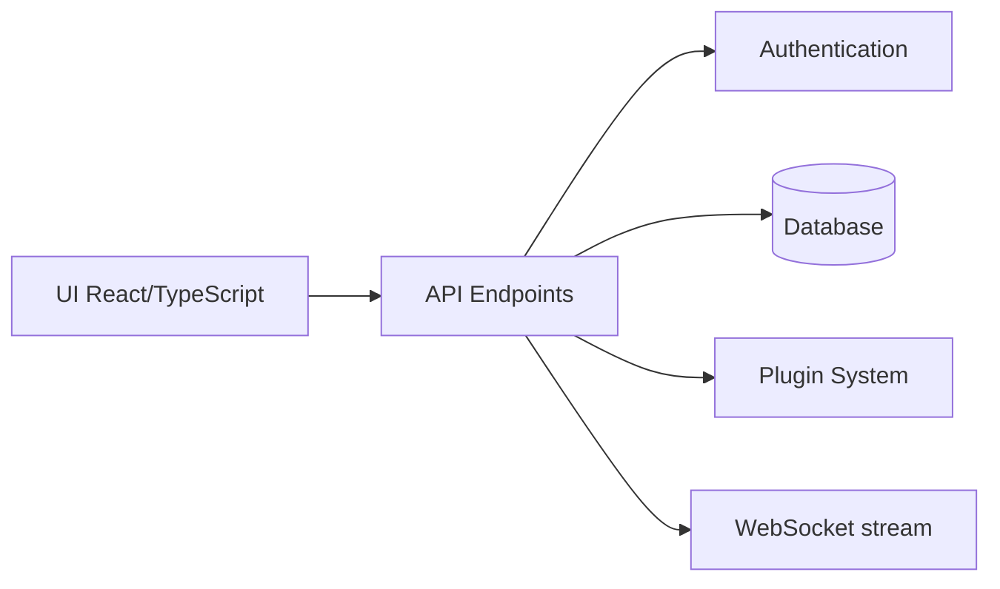

# gotify/server

> Serveur de notifications auto-hébergé : envoi par API REST, réception en temps réel par WebSocket.

## Le problème
Les services de notification existants sont soit commerciaux, soit abandonnés ; l'auteur voulait un serveur simple à héberger soi-même.

## Ce que ça fait vraiment
Envoi de messages via REST, réception par WebSocket, gestion des utilisateurs, clients et applications, plugins, interface web (`./ui`), CLI (`gotify/cli`) et application Android (`gotify/android`). D'après le code : backend Go (api, auth, database, plugin, router) et interface React/TypeScript.

## Comment c'est branché

## Essayer
Aucune commande dans le README : liens vers l'installation et la configuration.

## Coût et pièges
Licence présente mais non identifiée par GitHub : à vérifier. Le README est court, installation dans la documentation externe.

## Ce que ce n'est pas
Ce n'est pas un service de push hébergé. Le README ne précise ni l'installation ni les limites.

## Alternatives
Aucune alternative nommée dans le README.

## Pour toi
À surveiller : bon candidat pour recevoir les alertes de tes jobs ML, à condition de confirmer la licence.

