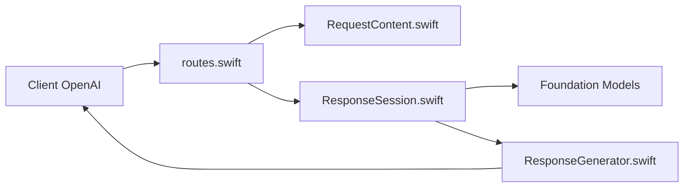

# gouwsxander/Apple-Intelligence-API

> Serveur Swift exposant les modèles Apple Intelligence embarqués via une API compatible OpenAI.

## Le problème
Les modèles Foundation Models d'Apple ne sont utilisables que depuis du code Swift natif, pas depuis des clients OpenAI.

## Ce que ça fait vraiment
Serveur Vapor : `/api/v1/chat/completions` (une requête ou conversation), streaming SSE, sorties structurées JSON, liste de modèles `base` et `permissive`. Tout tourne sur l'appareil, sans clé d'API. Pas d'authentification, d'appel d'outils ni de tests.

## Comment c'est branché


## Essayer
```bash
swift build
swift run AppleIntelligenceApi serve
curl http://localhost:8080/api/v1/chat/completions -H "Content-Type: application/json" -d '{"model":"base","messages":[{"role":"user","content":"What is the capital of France?"}]}'
```

## Coût et pièges
Gratuit, mais exige un appareil Apple Intelligence et Swift 6.0+. Sans authentification : ne pas l'exposer sur le réseau.

## Ce que ce n'est pas
Pas un service cloud ni un modèle puissant ; non officiel, sans lien avec Apple. Fonctionnalités incomplètes, aucun test. Dernier push janvier 2026.

## Alternatives
Aucune alternative citée dans le README.

## Pour toi
À surveiller : pratique pour tester le modèle local d'Apple depuis tes outils OpenAI, mais ça reste un prototype sans authentification.

