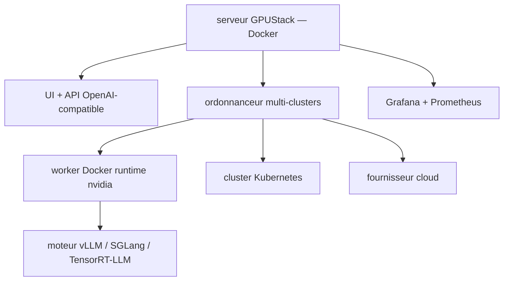

# gpustack/gpustack

> Gestionnaire de clusters GPU qui configure les moteurs d'inférence et provisionne des instances.

## Le problème
Un parc GPU réparti entre serveurs sur site, Kubernetes et cloud n'a pas de vue unique, et chaque modèle demande de régler vLLM ou SGLang à la main.
Le jour de la sortie d'un modèle, il faut refaire ce réglage.

## Ce que ça fait vraiment
Il gère plusieurs clusters GPU à la fois — on-premise, Kubernetes, fournisseurs cloud — et alloue les GPU via son ordonnanceur.
Il configure automatiquement vLLM, SGLang, TensorRT-LLM, ou un moteur maison, avec des modes pré-réglés latence basse ou débit élevé, LMCache/HiCache pour le TTFT, et du décodage spéculatif (EAGLE3, MTP, n-grammes).
Il lance à la demande des instances GPU accessibles en SSH pour le développement, le fine-tuning ou les charges interactives.
Il expose des API standard (LLM, voix, image, vidéo) compatibles OpenAI, avec authentification, contrôle d'accès, métrage des tokens et dashboards Grafana/Prometheus.

## Comment c'est branché


## Essayer
```bash
sudo docker run -d --name gpustack \
    --restart unless-stopped \
    -p 80:80 \
    --volume gpustack-data:/var/lib/gpustack \
    gpustack/gpustack
sudo docker exec gpustack cat /var/lib/gpustack/initial_admin_password
```

## Coût et pièges
Gratuit à installer, mais il faut au moins un GPU NVIDIA avec pilote, Docker et NVIDIA Container Toolkit ; les workers ne tournent que sous Linux (macOS exclu, Windows via WSL2 sans Docker Desktop).
Le worker se lance `--privileged`, `--network=host` et avec le socket Docker monté : à peser avant de l'ouvrir.

## Ce que ce n'est pas
Ce n'est pas entièrement open source : la vue « GPU Cluster Topology » est explicitement dans GPUStack Enterprise.
Ce n'est pas un moteur d'inférence — il configure et orchestre ceux des autres. Les gains de débit annoncés renvoient à un « Inference Performance Lab » maison.

## Alternatives
- vLLM, SGLang, TensorRT-LLM : les moteurs eux-mêmes, si un seul nœud suffit.

## Pour toi
Utile dès que le parc GPU dépasse une machine ; regarde d'abord ce qui bascule dans l'édition Enterprise.
