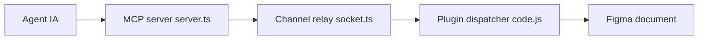

# grab/cursor-talk-to-figma-mcp

> Pont MCP permettant à un agent (Cursor, Claude Code) de lire et modifier des designs Figma.

## Le problème
Un agent IA ne voit pas le canevas Figma et ne peut ni lire ni modifier un design.

## Ce que ça fait vraiment
Un serveur MCP TypeScript expose des outils (lecture de sélection, création de frames et textes, auto-layout, styles, composants, export d'image). Il parle à un plugin Figma via un relais WebSocket par canaux (`join_channel`). Il fournit aussi des prompts guides, par exemple le remplacement de texte en masse.

## Comment c'est branché


## Essayer
```bash
curl -fsSL https://bun.sh/install | bash
bun setup
bun socket
```
Puis installer le plugin Figma et utiliser `join_channel`.

## Coût et pièges
Bun, Figma (compte) et un agent compatible MCP. Sous WSL, décommenter `hostname: "0.0.0.0"` dans `src/socket.ts`.

## Ce que ce n'est pas
Pas un générateur de design : il exécute les actions demandées par l'agent. L'export d'image est limité (base64 en texte).

## Alternatives
Aucune alternative nommée dans le README.

## Pour toi
À surveiller : exemple utile d'intégration MCP agent-outil, mais d'intérêt data/MLOps limité sauf si tu travailles avec des designers.

