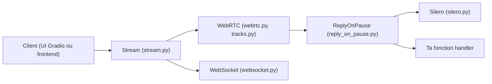

# gradio-app/fastrtc

> Bibliothèque Python qui transforme une fonction en flux audio ou vidéo temps réel via WebRTC ou WebSocket.

## Le problème
Brancher micro, caméra et détection de pause à un modèle (STT, LLM, TTS) demande beaucoup de plomberie WebRTC.

## Ce que ça fait vraiment
Un objet `Stream` enveloppe un handler Python : `ReplyOnPause` gère détection de voix et tour de parole (Silero), l'utilisateur ne code que la réponse. `.ui.launch()` ouvre une interface Gradio, `.mount(app)` expose des points d'accès WebRTC et WebSocket sur FastAPI, `.fastphone()` donne un numéro de téléphone temporaire (jeton Hugging Face requis). Extras `vad` et `tts`. Exemples : Gemini, OpenAI Realtime, Whisper, YOLOv10, Moshi.

## Comment c'est branché


## Essayer
```bash
pip install fastrtc
pip install "fastrtc[vad, tts]"
# stream.ui.launch()   |   stream.mount(app) avec FastAPI + uvicorn
```

## Coût et pièges
Gratuit ; l'exemple de chat vocal utilise Groq, Anthropic et ElevenLabs : clés à ta charge. Dernier push en janvier 2026, 82 issues ouvertes.

## Ce que ce n'est pas
Pas un modèle vocal : seulement le transport et la détection de tours. Le téléphone temporaire n'est pas un service de production.

## Alternatives
Non documenté dans le README : aucune alternative nommée.

## Pour toi
À adopter pour prototyper un assistant vocal ou une démo de vision temps réel en Python : c'est la brique qui évite d'écrire WebRTC soi-même.

