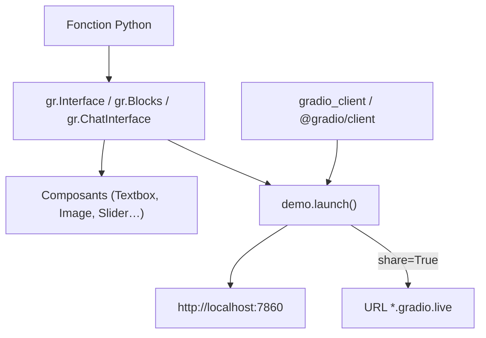

# gradio-app/gradio

> Bibliothèque Python qui emballe une fonction dans une démo web partageable en une ligne.

## Le problème
Faire essayer un modèle à quelqu'un d'autre impose sinon une interface, un serveur et une URL,
pour une démonstration qui devrait tenir en dix lignes.

## Ce que ça fait vraiment
`gr.Interface` prend une fonction, une liste de composants d'entrée et une de sortie, et rend une
page. Plus de 30 composants intégrés (`gr.Textbox`, `gr.Image`, `gr.HTML`…) pensés pour le ML.
`gr.Blocks` donne la main sur la mise en page, les flux de données croisés et la visibilité
conditionnelle ; `gr.ChatInterface` fabrique une interface de chatbot à partir d'une fonction.
`share=True` génère une URL publique en quelques secondes, le calcul restant sur ta machine.
Des clients Python et JavaScript interrogent n'importe quelle application Gradio par programme.

## Comment c'est branché


## Essayer
```bash
pip install --upgrade gradio
python app.py
gradio app.py          # rechargement à chaud
gradio --vibe app.py   # chat intégré pour éditer l'app
gradio skills add
```

## Coût et pièges
Gratuit, Python 3.10 minimum. `share=True` fait transiter le trafic par une URL `gradio.live`
hébergée par l'éditeur : c'est un tunnel vers ta machine, à éviter pour des données sensibles.
Hugging Face Spaces est le mode d'hébergement mis en avant, donc un tiers de plus.

## Ce que ce n'est pas
Ce n'est pas un service de mise en production : `launch()` sert une démo, pas une charge réelle.
Ce n'est pas un framework front : la personnalisation reste dans les limites des composants.
Le mode `--vibe` fait écrire l'app par un modèle, ce qui suppose une clé et une relecture.

## Alternatives
Aucune alternative nommée dans le README.

## Pour toi
L'outil de démo quand l'objet à montrer est un modèle avec des entrées typées, pas un tableau de bord.
