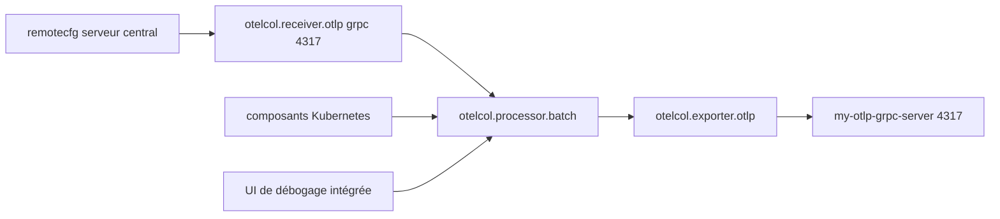

# grafana/alloy

> Distribution ouverte du collecteur OpenTelemetry, avec pipelines Prometheus intégrés.

## Le problème
Métriques, journaux, traces et profils passent par des collecteurs différents, configurés séparément.
Les assembler en une chaîne cohérente demande de la colle maison.

## Ce que ça fait vraiment
Une syntaxe à base d'expressions pour décrire des pipelines d'observabilité programmables.
Une distribution d'OpenTelemetry Collector qui en supporte des dizaines de composants, plus les siens.
S'intègre avec OpenTelemetry Collector, Prometheus, Grafana Loki et Grafana Pyroscope, et pas seulement Grafana.
Composants natifs Kubernetes, mise en grappe pour répartir la charge, configuration centralisée via `remotecfg`.

## Comment c'est branché


## Essayer
```alloy
otelcol.receiver.otlp "example" {
  grpc {
    endpoint = "127.0.0.1:4317"
  }
  output {
    metrics = [otelcol.processor.batch.example.input]
  }
}
```
La commande d'installation n'est pas dans le README : il renvoie aux instructions en ligne.

## Coût et pièges
Gratuit et sans dépendance à Grafana Cloud, mais il faut un backend pour recevoir ce qui est collecté.
Cadence de publication : une version mineure toutes les trois semaines, correctifs toutes une à deux semaines.

## Ce que ce n'est pas
Pas un stockage ni une interface : il collecte et transforme, rien de plus.
Pas un opérateur Kubernetes — les composants remplacent ce rôle, ce qui change les habitudes.
Pas identique au collecteur OTel amont : c'est une distribution avec sa propre syntaxe.

## Alternatives
Le collecteur OpenTelemetry amont, dont Alloy est une distribution.

## Pour toi
Bon candidat si tu veux un seul agent pour métriques, logs et profils ; la syntaxe propre est le vrai coût d'entrée.
