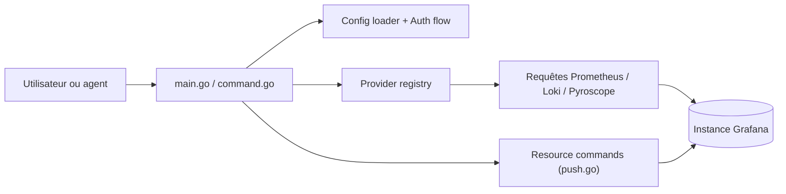

# grafana/gcx

> CLI Grafana pour interroger métriques, logs, traces et alertes, et donner ces données à un agent de code.

## Le problème
Enquêter sur la production oblige à quitter l'éditeur pour Grafana. Un agent de code n'a pas d'accès structuré à ces données.

## Ce que ça fait vraiment
Une commande unique (`gcx`) pour requêter Prometheus, Loki, Tempo, Pyroscope, lister dashboards et règles d'alerte, faire du GitOps (`resources pull/push`) et de l'observabilité en code (Go). Sur Grafana Cloud s'ajoutent SLO, Synthetic Monitoring, IRM, k6 et l'Assistant. Un lot de skills pour agents s'installe avec un plugin Claude Code.

## Comment c'est branché


## Essayer
```bash
curl -fsSL https://raw.githubusercontent.com/grafana/gcx/main/scripts/install.sh | sh
gcx login local --server http://localhost:3000 --token <token>
gcx metrics query 'rate(http_requests_total[5m])' --since 1h
gcx dashboards list
gcx resources pull dashboards -p ./resources -o yaml
```

## Coût et pièges
L'outil est gratuit, mais l'Assistant est facturé au token, Synthetic Monitoring à l'exécution, k6 à l'heure-utilisateur et IRM par utilisateur actif. Grafana 12+ requis (13 pour écrire des règles gérées). `resources delete` n'a pas de confirmation.

## Ce que ce n'est pas
Ce n'est pas un serveur Grafana. Les commandes SLO, IRM ou Assistant ne marchent pas sur Grafana OSS. Il envoie des statistiques d'usage à Grafana Labs (désactivables).

## Alternatives
Le README cite Git Sync de Grafana pour la synchronisation bidirectionnelle des dashboards.

## Pour toi
À surveiller : très pertinent si tu utilises Grafana en MLOps avec un agent de code ; la télémétrie par défaut et la dépendance à Grafana Cloud pour l'essentiel des fonctions sont à peser.

