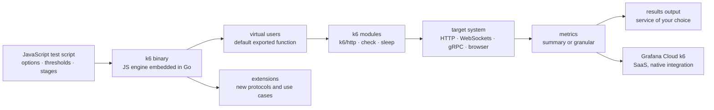

# grafana/k6

> **A Go load generator driven by version-controlled JavaScript test scripts, for developers and testers.**

## The problem

Checking that a service holds up under load is often done with tools whose scenario lives in a
GUI or an XML file: impossible to review as code, to version properly, or to run inside a CI
pipeline. And the pass/fail criteria stay in the head of whoever launched the run, instead of
being written next to the scenario itself.

## What it actually does

k6 runs a test scenario written in JavaScript and measures how the target system behaves under a
load described in the very same file. The README shows the mechanism: an exported `options`
object carries the `stages` (ramp to 15 virtual users over 30s, a one-minute plateau, ramp down
over 20s) and the `thresholds` (`http_req_duration: ["p(99) < 3000"]`), while the default
exported function describes one simulated user's behaviour — an HTTP request, a `check` on the
response status, a `sleep`.

The JavaScript engine is embedded in a Go binary: the README claims "the performance of Go, the
scripting familiarity of JavaScript", and that even lower-end machines can simulate a lot of
traffic. On protocols, the README lists HTTP, WebSockets, gRPC and a browser mode. Anything
beyond goes through extensions, an ecosystem the README describes as large and catalogued in the
documentation. Metrics come out as summary statistics or granular measurements, exported to the
service of your choice; Grafana Cloud k6 is the native, SaaS-hosted integration.

## How it is wired



No code-derived diagram exists for this repository: the graph above is reconstructed from the
README alone, so it names the moving parts rather than the repository's files. The thing to keep
in mind: the script is not a config file read by an external engine, it *is* the program — load
profile, thresholds and user behaviour all live in one JavaScript module.

## Trying it

The README gives **no command at all**: neither install nor run. It points to the releases page
for a binary download, and to the documentation's "Get Started" page to install, run a test and
inspect results. Nothing is reconstructed here. The only executable material in the README is
the example script, to be saved in a file:

```js
import http from "k6/http";
import { check, sleep } from "k6";

// Test configuration
export const options = {
  thresholds: {
    // Assert that 99% of requests finish within 3000ms.
    http_req_duration: ["p(99) < 3000"],
  },
  // Ramp the number of virtual users up and down
  stages: [
    { duration: "30s", target: 15 },
    { duration: "1m", target: 15 },
    { duration: "20s", target: 0 },
  ],
};

// Simulated user behavior
export default function () {
  let res = http.get("https://quickpizza.grafana.com");
  // Validate response status
  check(res, { "status was 200": (r) => r.status == 200 });
  sleep(1);
}
```

The README only states that such a script runs "on the CLI, or in your CI, or across a Kubernetes
cluster", without giving the invocation.

## Cost and pitfalls

- **AGPL-3.0 licence**, declared both in the README and in the catalogue. In a company setting
  this is the first thing to settle: the AGPL's network copyleft has consequences as soon as you
  modify k6 or ship it behind a service. Using the binary to test your own system is the ordinary
  case; writing an extension or embedding the engine is another, and needs sign-off.
- **No stated prerequisite**: a self-contained binary, no Node runtime or JVM to install. The
  README says nothing, however, about supported platforms, minimum versions, or how to size the
  load-generating machine beyond "even lower-end machines".
- **The SaaS is where it starts costing.** Grafana Cloud k6 is presented as the native integration
  for test execution, metrics correlation and data analysis: the local tool is free, the hosted
  part is a commercial product whose quotas and pricing the README does not mention.
- **JavaScript, but not Node.** The engine is embedded and the API is the `k6/*` modules: do not
  count on the npm ecosystem or on Node APIs inside a test script.
- **Extensions are one more dependency**: the README describes them as widely shared by the
  community, which also means maintained outside this repository, at their own quality and pace.

## What it is not

- **It is not a functional testing tool.** The `check` calls in the script qualify a response
  under load; they are not a substitute for an acceptance test suite.
- **It is not a platform with a GUI.** The README owns this so plainly that it redirects people
  who would rather not write code to a different repository, `grafana/k6-studio`.
- **It is not a metrics store or dashboard**: k6 produces measurements and exports them; where
  they live, correlate and get displayed is another product — Grafana Cloud k6, or the output of
  your choice.
- **It is not a tool that natively covers every protocol** either: beyond HTTP, WebSockets, gRPC
  and browser, you go through an extension.

## Alternatives

The README names a single related project: **`grafana/k6-studio`**, a desktop application from
the same vendor, to prefer when you want to generate k6 scripts without touching code — a
companion upstream of k6, not a replacement.

The catalogue's suggested neighbours (`evilmartians/lefthook`, `mgechev/revive`,
`testcontainers/testcontainers-go`, `edoardottt/cariddi`) are not comparable: pre-commit hooks, a
Go linter, a throwaway-container runner for integration tests, and a URL crawler — lexically
close through "testing" and "Go", but none of them generates load. So: no comparable alternative
in the catalogue.

## For you

Useful the moment you put a model behind an API: measuring inference-endpoint latency under load
and pinning a `p(99)` threshold that runs in CI is exactly what k6 does well, and the scenario is
versioned next to the service. The self-contained binary makes it easy to drop into a CI image.
Settle one thing before adopting: the AGPL licence, harmless for internal testing use, but worth
a legal check as soon as you consider an in-house extension or embedding it in a product.
