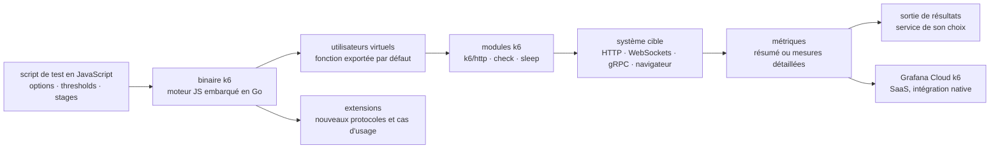

# grafana/k6

> **Un générateur de charge en Go piloté par des scripts JavaScript versionnés, pour développeurs et testeurs.**

## Le problème

Vérifier qu'un service tient la charge se fait souvent avec des outils dont le scénario vit
dans une interface graphique ou un fichier XML : impossible à relire en revue de code, à
versionner proprement, à faire tourner dans une chaîne d'intégration. Et les critères de
réussite restent dans la tête de celui qui a lancé le test, au lieu d'être écrits à côté du
scénario.

## Ce que ça fait vraiment

k6 exécute un scénario de test écrit en JavaScript et mesure le comportement du système cible
sous une charge que l'on décrit dans le même fichier. Le README montre le mécanisme : un objet
`options` exporté par le script porte les `stages` (montée à 15 utilisateurs virtuels sur 30 s,
palier d'une minute, descente sur 20 s) et les `thresholds` (`http_req_duration: ["p(99) <
3000"]`), tandis que la fonction exportée par défaut décrit le comportement d'un utilisateur
simulé — requête HTTP, `check` sur le statut de réponse, `sleep`.

Le moteur JavaScript est embarqué dans un binaire Go : le README annonce « la performance de Go,
la familiarité de JavaScript », et le fait que des machines modestes suffisent à simuler
beaucoup de trafic. Côté protocoles, le README liste HTTP, WebSockets, gRPC et un mode
navigateur. Le reste passe par des extensions, un écosystème que le README présente comme large
et recensé dans la documentation. Les métriques sortent en statistiques agrégées ou en mesures
détaillées, exportables vers le service de son choix ; Grafana Cloud k6 est l'intégration
native, en SaaS.

## Comment c'est branché



Aucun diagramme tiré du code n'existe pour ce dépôt : ce schéma est reconstruit depuis le seul
README, et n'en nomme donc que les pièces, pas les fichiers du dépôt. À retenir : le script
n'est pas un fichier de configuration lu par un moteur externe, c'est le programme lui-même — la
charge, les seuils et le comportement utilisateur tiennent dans le même module JavaScript.

## Essayer

Le README ne donne **aucune commande** : ni installation, ni exécution. Il renvoie à la page des
releases pour télécharger un binaire et à la page « Get Started » de la documentation pour
installer, lancer un test et lire les résultats. Rien n'est reconstruit ici. La seule matière
exécutable du README est le script d'exemple, à enregistrer dans un fichier :

```js
import http from "k6/http";
import { check, sleep } from "k6";

// Test configuration
export const options = {
  thresholds: {
    // Assert that 99% of requests finish within 3000ms.
    http_req_duration: ["p(99) < 3000"],
  },
  // Ramp the number of virtual users up and down
  stages: [
    { duration: "30s", target: 15 },
    { duration: "1m", target: 15 },
    { duration: "20s", target: 0 },
  ],
};

// Simulated user behavior
export default function () {
  let res = http.get("https://quickpizza.grafana.com");
  // Validate response status
  check(res, { "status was 200": (r) => r.status == 200 });
  sleep(1);
}
```

Le README précise seulement qu'un script de ce type se lance « en ligne de commande, dans une
chaîne d'intégration, ou sur un cluster Kubernetes », sans en donner l'invocation.

## Coût et pièges

- **Licence AGPL-3.0**, déclarée dans le README et dans le catalogue. C'est le point à traiter
  en premier en contexte d'entreprise : le copyleft réseau de l'AGPL a des conséquences dès
  qu'on modifie k6 ou qu'on le distribue derrière un service. Utiliser le binaire pour tester
  son propre système est un cas ordinaire ; écrire une extension ou intégrer le moteur en est un
  autre, à faire valider.
- **Pas de prérequis annoncé** : un binaire autonome, pas de runtime Node ni de JVM à installer.
  Le README n'indique cependant ni plateforme supportée, ni version minimale, ni dimensionnement
  de la machine de charge au-delà de « même des machines modestes ».
- **Le SaaS est l'endroit où ça devient payant.** Grafana Cloud k6 est présenté comme intégration
  native pour l'exécution des tests, la corrélation des métriques et l'analyse : l'outil en local
  est gratuit, la partie hébergée est un produit commercial dont le README ne dit rien des
  quotas ni du prix.
- **JavaScript, mais pas Node.** Le moteur est embarqué et l'API est celle des modules `k6/*` :
  ne pas compter sur l'écosystème npm ni sur les API de Node dans un script de test.
- **Les extensions sont une dépendance de plus** : le README les décrit comme largement partagées
  par la communauté, ce qui veut dire aussi maintenues hors du dépôt, avec leur propre qualité et
  leur propre rythme.

## Ce que ce n'est pas

- **Ce n'est pas un outil de test fonctionnel.** Les `check` du script vérifient une réponse pour
  qualifier la charge, pas pour tenir lieu de suite de tests d'acceptation.
- **Ce n'est pas une plateforme avec interface graphique.** Le README l'assume au point de
  renvoyer ceux qui ne veulent pas écrire de code vers un autre dépôt, `grafana/k6-studio`.
- **Ce n'est pas un système de stockage ni de visualisation de métriques** : k6 produit des
  mesures et les exporte ; l'endroit où elles vivent, se corrèlent et s'affichent est un autre
  produit, Grafana Cloud k6 ou la sortie de son choix.
- **Ce n'est pas non plus un outil qui couvre nativement tout protocole** : au-delà de HTTP,
  WebSockets, gRPC et navigateur, on passe par une extension.

## Alternatives

Le README ne nomme qu'un seul projet apparenté : **`grafana/k6-studio`**, application de bureau
du même éditeur, à préférer quand on veut générer des scripts k6 sans écrire de code — c'est un
complément en amont de k6, pas un remplaçant.

Les voisins proposés par le catalogue (`evilmartians/lefthook`, `mgechev/revive`,
`testcontainers/testcontainers-go`, `edoardottt/cariddi`) ne sont pas comparables : ce sont des
hooks de pré-commit, un linter Go, un lanceur de conteneurs jetables pour tests d'intégration et
un explorateur d'URL — proches par le lexique du test et du Go, mais aucun ne génère de charge.
Aucune alternative comparable dans le catalogue, donc.

## Pour toi

Utile dès qu'on met un modèle derrière une API : mesurer la latence d'un point d'inférence sous
charge et fixer un seuil `p(99)` exécutable dans la chaîne d'intégration est exactement ce que
k6 fait bien, et le scénario se versionne à côté du service. Le binaire autonome facilite son
usage dans une image de CI. À trancher avant d'adopter : la licence AGPL, sans conséquence pour
un usage interne de test, mais à faire valider dès qu'on envisage une extension maison ou une
intégration dans un produit.
