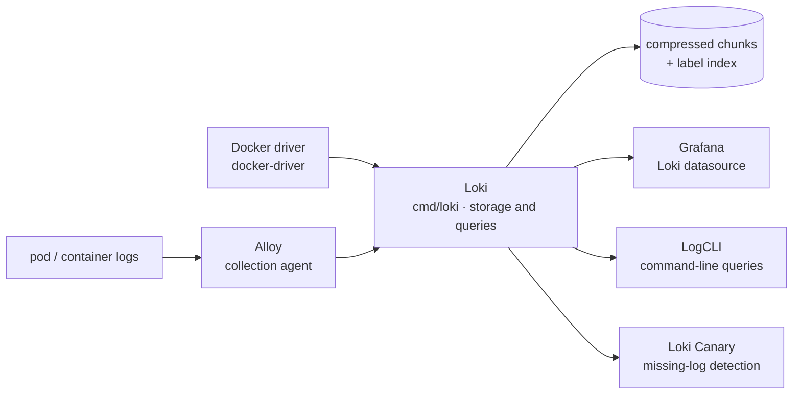

# grafana/loki

> **A log aggregation server that indexes labels instead of text, for platform and operations teams.**

## The problem

Storing logs from a fleet of containers usually implies an engine that indexes the full text:
the index often weighs more than the data, and it has to be sized, backed up and operated. And
when an incident starts, moving from Prometheus metrics to logs means changing vocabulary,
selectors and tooling, although both answer the same question at the same instant.

## What it actually does

Loki stores compressed, unstructured logs and only indexes a set of labels per log stream. The
README states this as the central choice: no full text indexing, which its authors present as
making the system simpler to operate and cheaper to run. The labels are the ones already used
with Prometheus, so the same selectors carry over from metrics to logs.

Ingestion happens by push, not by pull as in Prometheus. The README describes a
horizontally-scalable, highly-available, multi-tenant system; multi-tenancy is turned on with
`auth_enabled: true` plus a runtime config carrying per-tenant overrides. The repository
targets both a single-binary, no-dependency deployment and a microservices deployment. The
showcased use case is Kubernetes Pod logs, whose metadata (Pod labels) is scraped and indexed
automatically.

Around the server, the README lists the pieces kept inside the same documentation scope: an
HTTP API for getting logs in, `LogCLI` for querying from the command line, a Docker plugin
that sends container logs straight to Loki, and Loki Canary, which watches a Loki installation
for missing logs.

## How it is wired



No code-derived diagram exists for this repository: this one is rebuilt from the README alone.
The README describes a three-component stack — Alloy gathers and ships, Loki stores and
processes queries, Grafana queries and displays — and notes that Alloy replaced Promtail,
Promtail being considered feature complete while future log-collection work happens in Alloy.
The binary is built from `./cmd/loki` and starts on `cmd/loki/loki-local-config.yaml`.

## Try it

The README documents a single-host, no-dependency mode that needs an up-to-date Go (the
version found in the repository `Makefile`):

```bash
# Checkout source code
$ git clone https://github.com/grafana/loki
$ cd loki

# Build binary
$ go build ./cmd/loki

# Run executable
$ ./loki -config.file=./cmd/loki/loki-local-config.yaml
```

On Unix systems, `make` adds extra arguments to the build:

```bash
# Build binary
$ make loki

# Run executable
$ ./cmd/loki/loki -config.file=./cmd/loki/loki-local-config.yaml
```

For multiple local tenants, with `auth_enabled` set to true:

```bash
# Build binary
$ make loki

# Run executable
./loki -config.file=./cmd/loki/loki-local-multi-tenant-config.yaml -runtime-config.file=./cmd/loki/loki-overrides.yaml
```

The packaged installation paths (Loki, Alloy, getting started) are not described in the
README; it links out to the Grafana documentation.

## Cost and traps

- **AGPL-3.0-only licence**, with Apache-2.0 exceptions listed in `LICENSING.md`. This is the
  first thing to settle: the AGPL's network copyleft covers an exposed service, not only a
  distributed binary. Read `LICENSING.md` to know which parts are Apache-2.0.
- **The Helm chart is moving out.** The README announces that effective 16 March 2026 the Loki
  Helm chart is forked to `grafana-community/helm-charts`, the one in the Loki repository being
  maintained for GEL users only. An existing Kubernetes deployment must change chart source.
- **The full stack is not in this repository**: Alloy is needed to collect and Grafana (v6.0
  minimum for native support) to query. Loki on its own gives neither collection nor a UI.
- **Building from source** is the only path the README documents, with an up-to-date Go.
  Packages, images and manifests go through the online documentation.
- **The real cost is storage and operations**, not the licence: the software is free, but a
  scalable, highly-available deployment implies object storage and operational work that stay
  on you. The README puts no number on any of it.
- **Multi-tenancy is off by default**: `auth_enabled` must be set to true and paired with a
  runtime override config.

## What it is not

- **It is not a full text search engine.** That is the founding trade-off: only labels are
  indexed. A content search scans the chunks matching the selected labels; anyone expecting
  inverted-index behaviour over the text will be disappointed.
- **It is not Prometheus either**: the README itself states the two differences — the object
  (logs, not metrics) and the transport (push, not pull). Nor is it a Prometheus replacement,
  rather its counterpart.
- **It is not a collection agent**: Promtail was dropped from the stack in favour of Alloy,
  which lives in another repository. It is not a UI either — display and querying go through
  Grafana or LogCLI.
- **It is not a turnkey product**: the repository ships a server and its configuration;
  storage, sizing and retention remain operational work.

## Alternatives

| | When to prefer it |
|---|---|
| **grafana/alloy** | Named in the README, but not a competitor: it is the stack's collection agent, the one that replaced Promtail. It is installed *alongside* Loki, not instead of it. |
| **prometheus/prometheus** | Named in the README as the inspiration and the metrics counterpart. To be preferred — and installed in addition — when the question is about numeric time series rather than log lines. |
| **VictoriaMetrics/VictoriaLogs** | Catalogue neighbour with the same object: log aggregation. Worth a look if Loki's AGPL is a blocker or to compare indexing models; the README does not mention it, so nothing here lets us rank the two. |

The remaining suggested neighbour, `VictoriaMetrics/VictoriaMetrics`, deals with metrics rather
than logs: it is not an alternative to Loki.

## For you

On a platform already running Prometheus and Grafana, this is the logs counterpart that
introduces the least new vocabulary: same labels, same UI, smaller index cost. For a data /
MLOps profile, it is the way to correlate a drift in a training or inference-serving metric
with the log lines of the matching pod, without standing up a separate search stack. Skip it
if the expected use is full text exploration of a log corpus, or if the AGPL does not fly
where you work.
