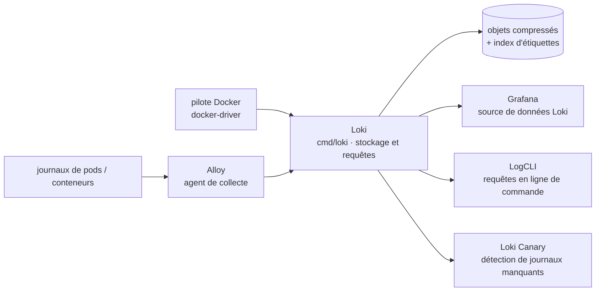

# grafana/loki

> **Un serveur d'agrégation de journaux qui indexe des étiquettes, pas le texte, pour équipes d'exploitation.**

## Le problème

Stocker les journaux d'une flotte de conteneurs suppose d'ordinaire un moteur qui indexe
intégralement le texte : l'index pèse souvent plus que les données, il faut le dimensionner,
le sauvegarder, l'exploiter. Et au moment d'une panne, on passe des métriques Prometheus aux
journaux en changeant de vocabulaire, de sélecteurs et d'outil, alors qu'on cherche la même
chose au même instant.

## Ce que ça fait vraiment

Loki stocke les journaux compressés et non structurés, et n'indexe qu'un jeu d'étiquettes par
flux. Le README l'énonce comme le choix central : pas d'indexation plein texte, ce qui rend le
système, selon ses auteurs, plus simple à opérer et moins cher à faire tourner. Les étiquettes
sont celles qu'on utilise déjà avec Prometheus, ce qui permet de passer des métriques aux
journaux avec les mêmes sélecteurs.

La réception se fait en *push*, et non en *pull* comme Prometheus. Le README annonce un
système horizontalement extensible, hautement disponible et multi-locataire ; le mode
multi-locataire s'active par `auth_enabled: true` et une configuration d'exécution portant les
surcharges par locataire. Le dépôt vise aussi bien un déploiement en binaire unique sans
dépendance qu'un déploiement en microservices. Le cas d'usage mis en avant est le journal des
pods Kubernetes, dont les métadonnées (étiquettes de pod) sont collectées et indexées
automatiquement.

Autour du serveur, le README cite les pièces maintenues dans le même périmètre documentaire :
une API HTTP d'ingestion, `LogCLI` pour interroger en ligne de commande, un pilote Docker qui
envoie les journaux des conteneurs directement à Loki, et Loki Canary, qui surveille une
installation Loki en détectant les journaux manquants.

## Comment c'est branché



Aucun diagramme tiré du code n'existe pour ce dépôt : ce schéma est reconstruit depuis le seul
README. Celui-ci décrit une pile en trois composants — Alloy collecte et envoie, Loki stocke et
traite les requêtes, Grafana interroge et affiche — et précise qu'Alloy a remplacé Promtail,
ce dernier étant considéré comme complet, le développement de la collecte de journaux se
poursuivant dans Alloy. Le binaire se construit depuis `./cmd/loki` et démarre sur
`cmd/loki/loki-local-config.yaml`.

## Essayer

Le README documente un mode mono-machine sans dépendance, qui demande une version de Go à jour
(celle du `Makefile` du dépôt) :

```bash
# Checkout source code
$ git clone https://github.com/grafana/loki
$ cd loki

# Build binary
$ go build ./cmd/loki

# Run executable
$ ./loki -config.file=./cmd/loki/loki-local-config.yaml
```

Sur système Unix, `make` ajoute des arguments supplémentaires à la compilation :

```bash
# Build binary
$ make loki

# Run executable
$ ./cmd/loki/loki -config.file=./cmd/loki/loki-local-config.yaml
```

Pour plusieurs locataires en local, avec `auth_enabled` à `true` :

```bash
# Build binary
$ make loki

# Run executable
./loki -config.file=./cmd/loki/loki-local-multi-tenant-config.yaml -runtime-config.file=./cmd/loki/loki-overrides.yaml
```

Les chemins d'installation packagés (Loki, Alloy, prise en main) ne sont pas décrits dans le
README : il renvoie à la documentation en ligne de Grafana.

## Coût et pièges

- **Licence AGPL-3.0-only**, avec des exceptions Apache-2.0 listées dans `LICENSING.md`. C'est
  le point à trancher avant tout usage : le copyleft réseau de l'AGPL porte sur un service
  exposé, pas seulement sur un binaire distribué. Lire `LICENSING.md` pour savoir quelles
  parties sont en Apache-2.0.
- **Le chart Helm part ailleurs.** Le README annonce qu'à compter du 16 mars 2026 le chart Helm
  Loki est transféré vers le dépôt `grafana-community/helm-charts`, celui du dépôt Loki
  n'étant plus maintenu que pour les utilisateurs GEL. Un déploiement Kubernetes existant doit
  changer de source de chart.
- **La pile complète n'est pas dans ce dépôt** : il faut aussi Alloy pour collecter et Grafana
  (v6.0 minimum pour le support natif) pour interroger. Loki seul ne donne ni collecte ni
  interface.
- **Compilation depuis les sources** : le README ne documente que ce chemin, avec une version
  de Go à jour. Les paquets, images et manifestes passent par la documentation en ligne.
- **Le coût réel est le stockage et l'exploitation**, pas la licence : le logiciel est gratuit,
  mais un déploiement extensible et hautement disponible suppose un stockage d'objets et une
  exploitation qui restent à ta charge. Le README ne chiffre rien.
- **Multi-locataire non actif par défaut** : `auth_enabled` doit être mis à `true` et
  accompagné d'une configuration d'exécution de surcharges.

## Ce que ce n'est pas

- **Ce n'est pas un moteur de recherche plein texte.** C'est le renoncement fondateur : seules
  les étiquettes sont indexées. Une recherche sur le contenu parcourt les blocs correspondant
  aux étiquettes sélectionnées ; qui attend le comportement d'un index inversé sur le texte
  sera déçu.
- **Ce n'est pas Prometheus pour autant** : le README écrit lui-même que Loki en diffère sur
  deux points — l'objet (journaux et non métriques) et le transport (push et non pull). Ce
  n'est pas non plus un remplaçant de Prometheus, mais son pendant.
- **Ce n'est pas un agent de collecte** : Promtail a été retiré de la pile au profit d'Alloy,
  qui vit dans un autre dépôt. Ce n'est pas davantage une interface : l'affichage et les
  requêtes passent par Grafana ou LogCLI.
- **Ce n'est pas un produit clés en main** : le dépôt livre un serveur et sa configuration ;
  le reste (stockage, dimensionnement, rétention) est un travail d'exploitation.

## Alternatives

| | Quand le préférer |
|---|---|
| **grafana/alloy** | Nommé dans le README, mais ce n'est pas un concurrent : c'est l'agent de collecte de la pile, qui a remplacé Promtail. Il s'installe *avec* Loki, pas à la place. |
| **prometheus/prometheus** | Nommé dans le README comme l'inspiration et le pendant métriques. À préférer — et à installer en plus — quand la question porte sur des séries temporelles numériques et non sur des lignes de journal. |
| **VictoriaMetrics/VictoriaLogs** | Voisin du catalogue, même objet : agrégation de journaux. À regarder si la licence AGPL de Loki est bloquante ou si l'on veut comparer les modèles d'indexation ; il n'est pas cité par le README, donc rien ici ne permet de les départager. |

Le dernier voisin proposé, `VictoriaMetrics/VictoriaMetrics`, relève des métriques et non des
journaux : ce n'est pas une alternative à Loki.

## Pour toi

Sur une plateforme où tournent déjà Prometheus et Grafana, c'est le complément journaux qui
demande le moins de vocabulaire nouveau : mêmes étiquettes, même interface, coût d'index
réduit. Pour un profil data / MLOps, c'est le moyen de corréler une dérive de métrique
d'entraînement ou de service d'inférence avec les lignes de journal du pod correspondant, sans
monter une pile de recherche séparée. À écarter si l'usage attendu est l'exploration plein
texte d'un corpus de journaux, ou si l'AGPL ne passe pas chez toi.
