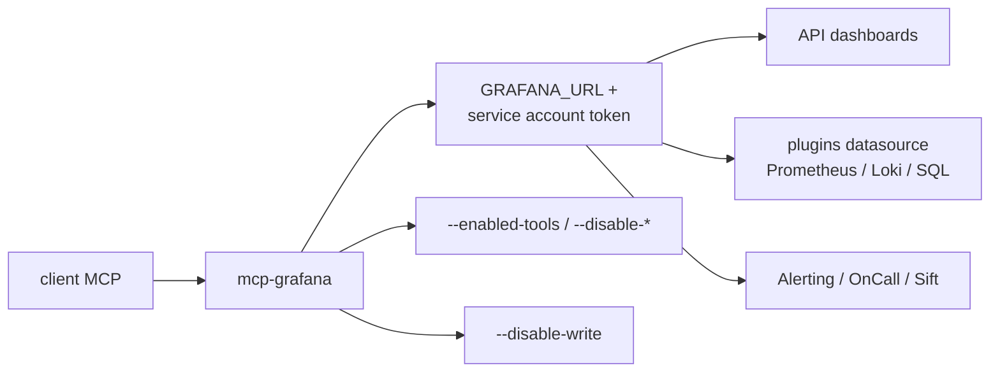

# grafana/mcp-grafana

> Serveur MCP officiel Grafana, pour brancher un agent sur dashboards, métriques et logs existants.

## Le problème
Un agent n'a aucun accès structuré à Grafana : il devine des URLs et recopie du JSON de dashboard.
Lire un gros dashboard entier fait exploser la fenêtre de contexte.

## Ce que ça fait vraiment
Outils dashboards (recherche, résumé compact, extraction par JSONPath, patch partiel), datasources,
requêtes Prometheus/Loki/SQL unifié (ClickHouse, Snowflake, Athena, MySQL, PostgreSQL, MSSQL),
CloudWatch, Graphite, Elasticsearch, InfluxDB, Quickwit. Alerting, OnCall, incidents, Sift, annotations,
snapshots, rendu PNG, deeplinks, provisioning, et l'observabilité d'agents (conversations, évaluateurs,
test suites, expériences offline) en Grafana Cloud.

## Comment c'est branché


## Essayer
```bash
uvx mcp-grafana
```

## Coût et pièges
Gratuit, mais il faut une instance Grafana 9.0+ et un service account token ; les permissions RBAC
sont à cadrer outil par outil (le README propose le rôle `Editor` comme raccourci peu granulaire).
Beaucoup de familles d'outils sont désactivées par défaut. Les identifiants des datasources SQL
restent dans Grafana : le serveur ne les voit pas.

## Ce que ce n'est pas
Ce n'est pas un connecteur en lecture seule par défaut : il crée des dashboards, des alertes, des incidents.
Ce n'est pas frugal en contexte si on appelle `get_dashboard_by_uid`. Le rendu PNG exige
le service Image Renderer, et l'observabilité d'agents ne marche qu'en Grafana Cloud.

## Alternatives
Aucune nommée dans le README.

## Pour toi
Le bon point d'entrée si ton observabilité est déjà sur Grafana : commence en `--disable-write`.
