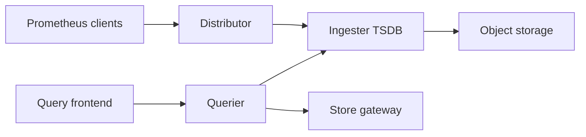

# grafana/mimir

> Stockage long terme multi-locataire et scalable pour métriques Prometheus, pour équipes plateforme.

## Le problème
Un seul Prometheus ne tient pas des milliards de séries ni la rétention longue.

## Ce que ça fait vraiment
Reçoit les écritures Prometheus, les répartit et les réplique sur des ingesters, persiste les blocs en stockage objet (S3, GCS, Azure, Swift), et sert PromQL via query frontend, querier et store gateway. Un compacteur fusionne les blocs ; un ruler évalue règles et alertes ; un Alertmanager notifie. Le mode monolithique tient dans un seul binaire. Le README annonce jusqu'à 1 milliard de séries actives en test interne.

## Comment c'est branché

## Essayer
Le README ne donne aucune commande ; il renvoie au guide de démarrage et au guide de déploiement.

## Coût et pièges
Stockage objet requis. Licence AGPL-3.0. Environ 850 issues ouvertes.

## Ce que ce n'est pas
Pas un outil de traçage ni de logs. Pas un remplaçant direct de Prometheus pour la collecte.

## Alternatives
- Thanos et Cortex : le README documente la migration depuis eux.

## Pour toi
À surveiller : pertinent si tu opères de la métrologie à grande échelle, sinon du superflu pour un profil data.
