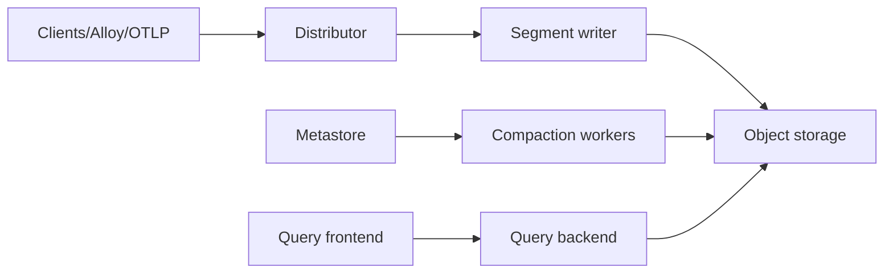

# grafana/pyroscope

> Backend de profilage continu multi-tenant (CPU, mémoire, I/O) visualisé dans Grafana.

## Le problème
Trouver quelle ligne de code consomme CPU ou mémoire en production demande de profiler en continu, pas ponctuellement.

## Ce que ça fait vraiment
Reçoit des profils pprof/Pyroscope ou OTLP depuis les SDK (Go, Java, Python, Ruby, Node, .NET, Rust, eBPF), Grafana Alloy ou OpenTelemetry.
v2 : un distributeur route par service vers des segment writers qui écrivent directement en stockage objet (S3, GCS, Azure…), sans ingesters.
Metastore Raft, compaction en tâche de fond, query frontend/backend produisant flame graphs et diffs.
UI « Profiles Drilldown » dans Grafana ; mode binaire unique ou microservices via Helm.

## Comment c'est branché


## Essayer
```bash
docker run -it -p 4040:4040 grafana/pyroscope
brew install pyroscope-io/brew/pyroscope
brew services start pyroscope
```

## Coût et pièges
Gratuit, AGPL-3.0 : exposer une version modifiée en service t'oblige à publier les sources.
Le stockage objet devient la dépendance centrale en v2.

## Ce que ce n'est pas
Pas un APM complet : ni traces ni logs.
La visualisation principale suppose Grafana.

## Alternatives
Aucune alternative nommée dans le README (py-spy, rbspy, speedscope sont crédités comme briques).

## Pour toi
À surveiller pour profiler des services d'inférence Python en prod : pertinent dès que la latence ou la mémoire devient un sujet.
