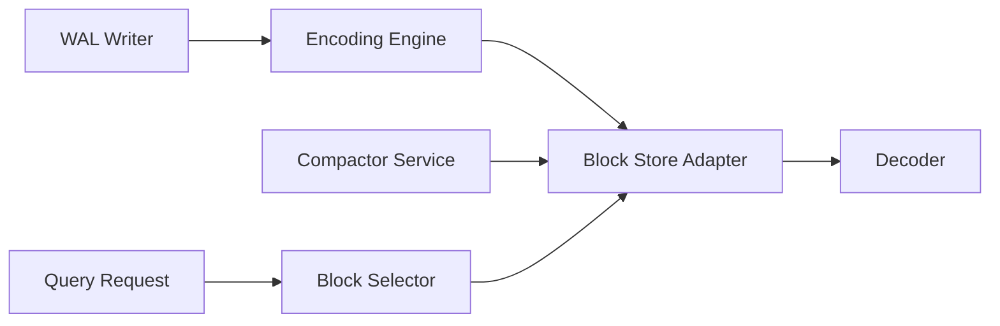

# grafana/tempo

> Backend de traçage distribué à grande échelle, qui ne demande qu'un stockage objet, pour équipes d'observabilité.

## Le problème
Comprendre le trajet d'une requête entre services, sans indexer les traces à grands frais.

## Ce que ça fait vraiment
Ingère des traces Jaeger, Zipkin, Kafka et OpenTelemetry, les met en tampon (WAL), les encode en blocs Parquet et les écrit sur S3, GCS, Azure ou disque local. Le langage TraceQL permet d'interroger les traces ; les métriques TraceQL sont expérimentales. Compacteur, politique de rétention et index par locataire complètent le moteur `tempodb`.

## Comment c'est branché

## Essayer
Le README ne fournit pas de commande ; il renvoie à la documentation de démarrage et à des exemples Docker Compose, Helm et Jsonnet.

## Coût et pièges
Stockage objet requis. Licence AGPL-3.0. L'interface d'exploration des traces est un composant Grafana séparé.

## Ce que ce n'est pas
Ce n'est pas un outil de visualisation : les problèmes d'UI se traitent côté Grafana. Ce n'est pas non plus un outil de métriques ou de logs (voir Prometheus, Loki).

## Alternatives
- Jaeger / Zipkin : formats compatibles, que Tempo peut ingérer.

## Pour toi
À surveiller : utile si tu instrumentes des services ou des pipelines LLM avec OpenTelemetry, mais c'est de l'infra plateforme, pas un outil data.
