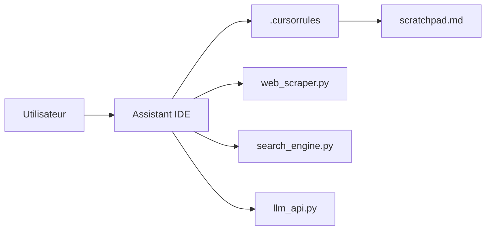

# grapeot/devin.cursorrules

> Fichiers de règles et scripts Python pour donner à Cursor ou Windsurf un comportement d'agent à la Devin.

## Le problème
Un assistant d'IDE agit sans plan écrit ni outils de recherche, et oublie les corrections de l'utilisateur d'une session à l'autre.

## Ce que ça fait vraiment
Fournit `.cursorrules`, `.windsurfrules` ou `.github/copilot-instructions.md`, un `scratchpad.md` de suivi de plan, et des scripts : scraping avec Playwright, recherche DuckDuckGo, analyse par LLM, capture d'écran. Le mode expérimental sépare un planificateur (o1) d'un exécuteur (Claude ou GPT). Les corrections de l'utilisateur sont consignées dans les règles comme « leçons apprises ».

## Comment c'est branché


## Essayer
```bash
pip install cookiecutter
cookiecutter gh:grapeot/devin.cursorrules --checkout template
```

## Coût et pièges
Les clés d'API (facultatives selon le README) restent à ta charge pour les modèles. Playwright installe ses navigateurs au premier usage. Dernier push en mai 2025.

## Ce que ce n'est pas
Pas un agent autonome : c'est un jeu d'instructions que l'IDE suit ou non. La comparaison de coût avec Devin vient du README.

## Alternatives
Devin : agent commercial dont ce dépôt veut reproduire l'effet à moindre coût.

## Pour toi
Surveiller : bonne base pour structurer plan, scratchpad et outils d'un assistant de code, mais le dépôt n'évolue plus depuis mai 2025.

