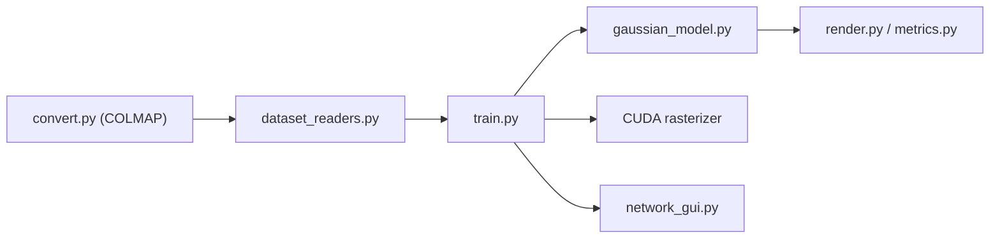

# graphdeco-inria/gaussian-splatting

> Implémentation officielle du 3D Gaussian Splatting pour la synthèse de vues nouvelles en temps réel, pour chercheurs en vision.

## Le problème
Les méthodes de champs de radiance coûtent cher à entraîner et à rendre, surtout à 1080p sur des scènes non bornées.

## Ce que ça fait vraiment
Un optimiseur PyTorch/CUDA produit un modèle de gaussiennes 3D à partir de photos et de données SfM (COLMAP). Il contient aussi un visionneur réseau, un visionneur temps réel OpenGL (SIBR) et un script `convert.py`. Ajouts récents : accélération d'entraînement, régularisation par profondeur, compensation d'exposition, anti-crénelage. Les auteurs disent avoir peu de moyens de maintenance.

## Comment c'est branché


## Essayer
```bash
git clone https://github.com/graphdeco-inria/gaussian-splatting --recursive
conda env create --file environment.yml
conda activate gaussian_splatting
python train.py -s <path to COLMAP or NeRF Synthetic dataset>
```

## Coût et pièges
GPU CUDA (capacité 7.0+), 24 Go de VRAM pour la qualité du papier ; CUDA SDK 11 et compilateur C++ compatibles. L'évaluation complète prend environ 7 h sur un A6000. Licence présente mais non identifiée par GitHub : à vérifier (usage non commercial possible).

## Ce que ce n'est pas
Ce n'est pas un produit clé en main : le support hors Windows 10 et Ubuntu 22.04 n'est pas assuré. Le passage à l'échelle d'une ville n'est pas prévu.

## Alternatives
Aucune alternative nommée dans le README (Taming-3DGS, Mip Splatting sont cités comme sources d'ajouts).

## Pour toi
Surveiller : référence pour la reconstruction 3D si tu as un GPU costaud, mais licence à clarifier et chaîne d'installation lourde.

