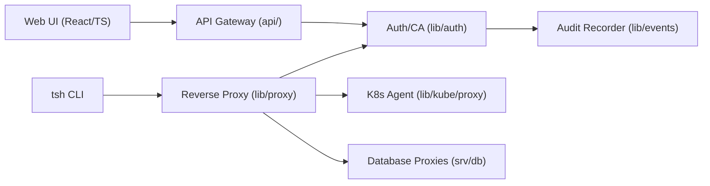

# gravitational/teleport

> Plan d'accès unifié : SSO, certificats courts et audit pour SSH, Kubernetes, bases et MCP.

## Le problème
Clés SSH partagées, tokens Kubernetes longue durée, bastions et VPN : l'accès à l'infrastructure est dispersé, peu audité et difficile à révoquer.

## Ce que ça fait vraiment
Une CA émet des certificats mTLS et SSH à expiration automatique, liés à une identité humaine ou machine.
Un proxy sensible à l'identité fait passer les connexions, y compris derrière NAT, sans VPN.
RBAC/ABAC, MFA, demandes d'accès juste-à-temps, enregistrement des sessions SSH, Kubernetes, bases, RDP.
Sécurise aussi les connexions MCP entre clients et serveurs d'agents.

## Comment c'est branché


## Essayer
```bash
git clone https://github.com/gravitational/teleport.git
cd teleport
make full
make -C build.assets build-binaries
```

## Coût et pièges
Auto-hébergeable, mais Teleport Enterprise Cloud est payant. Compiler demande Go, Rust, Node.js, libfido2 et au moins 1 Go de mémoire virtuelle.

## Ce que ce n'est pas
Pas un fournisseur d'identité : il s'appuie sur Okta, Entra ID, GitHub. AGPL-3.0. Pas un outil léger : c'est une brique d'infrastructure à opérer.

## Alternatives
Aucune alternative nommée ; le README se positionne contre les VPN et bastions.

## Pour toi
À surveiller : pertinent si tu gères l'accès d'une équipe à des clusters GPU et bases, surtout pour encadrer des agents via MCP ; surdimensionné pour un usage individuel.
