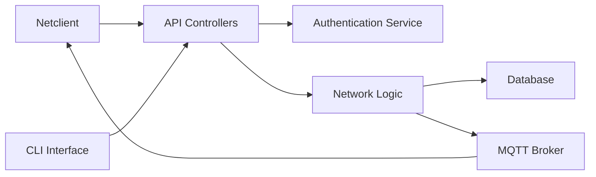

# gravitl/netmaker

> Automatisation de réseaux WireGuard (mesh, site-à-site, accès distant) auto-hébergée ou SaaS.

## Le problème
Relier datacenters, clouds et machines de bord en WireGuard à la main devient ingérable passé quelques nœuds.

## Ce que ça fait vraiment
Serveur qui crée et gère réseaux WireGuard, passerelles d'accès distant, VPN mesh et liaisons site-à-site.
UI d'admin, OAuth, DNS privé, listes de contrôle d'accès.
Client `netclient` sur Linux, Docker, Mac, Windows ; broker MQTT pour pousser la configuration.
Version Pro auto-hébergée et SaaS netmaker.io.

## Comment c'est branché


## Essayer
```bash
sudo wget -qO /root/nm-quick.sh https://raw.githubusercontent.com/gravitl/netmaker/master/scripts/nm-quick.sh && sudo chmod +x /root/nm-quick.sh && sudo /root/nm-quick.sh
```

## Coût et pièges
Nécessite une VM Ubuntu 24.04 à IP publique fixe, ports 443 et 51821 ouverts, DNS wildcard recommandé.
Licence non identifiée par GitHub ; fonctions haute dispo en Pro.

## Ce que ce n'est pas
Pas WireGuard lui-même : c'est une couche de gestion.
Pas un outil data ou ML.

## Alternatives
Aucune alternative nommée dans le README.

## Pour toi
À ignorer pour ton profil : utile à l'infra réseau, sans lien direct avec la data ; et la licence est à vérifier.
