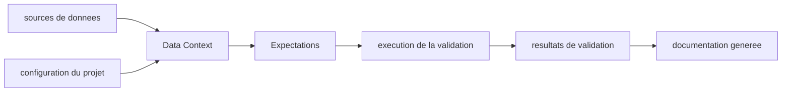

# great-expectations/great_expectations

> **Unit tests for data.** A Python data-quality library, for data teams validating tables.

## The problem

Without a dedicated tool, data quality is checked with ad hoc SQL and throwaway scripts, each
person in their own corner: there is no shared vocabulary for saying "this column must not be
null", and knowledge about the data stays in people's heads. The README states this goal
explicitly — preserving the organisation's institutional knowledge about its data.

## What it actually does

The core concept is **Expectations**: declarative assertions about a dataset, which the README
describes as extensible unit tests for your data. Around them, GX Core provides a **Data
Context**, the entry object returned by `gx.get_context()`, which holds configuration and
connections to data sources.
It **automatically generates documentation** from validation results, so the state of the data
is readable outside the team that wrote the rules.
What the README does not detail: the execution engine, checkpoints, scheduling. It points to
the online docs and a "compatibility reference" for the list of supported data sources — that
list is not in the README.

## How it is wired



No code-derived diagram exists for this repository: these nodes are inferred from the README
alone. The Data Context is the central piece — it is the only object the quickstart creates.
Expectations are expressed against it, validation produces results, and those results feed the
generated documentation. The real file names are not known here.

## Trying it

```bash
pip install great_expectations
```

```python
import great_expectations as gx

context = gx.get_context()
```

The README recommends doing this in an empty base directory inside a Python virtual
environment. It stops there: no validation command and no Expectation example are given,
everything points to `docs.greatexpectations.io`.

## Cost and traps

The package is free and installs with `pip`, with no API key or third-party service according
to the README. The real prerequisite is the **Python version**: `3.10` through `3.13`
officially, and `3.14` and later only experimentally, via the `GX_PYTHON_EXPERIMENTAL`
environment variable set at install time — worth checking before committing a pipeline to it.
A quieter trap: the README says nothing about the licence, and speaks of "GX Core" as one
brick among others, with case studies and a tiered support policy. There is a commercial
perimeter around it that the README does not delimit.
The README itself leans on promotional wording ("powerful", "super-simple") to describe the
tool: a signal worth noting, as the technical description is thin.

## What it is not

It is not a transformation engine nor an orchestrator: GX validates, it neither fixes nor
schedules anything. Nothing in the README suggests it moves or repairs data.
It is not a turnkey product either: the README shows only installation and context creation,
everything else lives outside the repository, in the online documentation.
Finally, "GX Core" is not the whole GX offering — the name itself suggests an open-source base
distinct from a commercial offering the README does not describe.

## Alternatives

No comparable alternative in the catalogue: the README names no competing tool and no
neighbouring repository was supplied for this entry. Any comparison with another data
validator would be invention here.

## For you

For a data / MLOps profile, this is the most established validation brick in the Python
ecosystem, and the fact that it produces documentation readable by non-developers is its real
argument. Worth watching rather than adopting blindly: the licence is not declared here, and
the boundary between open-source base and commercial offering remains to be checked outside
the README.
