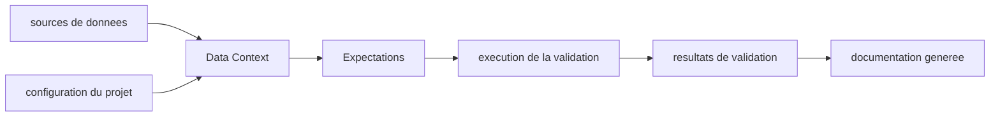

# great-expectations/great_expectations

> **Tests unitaires pour données.** Bibliothèque Python de qualité de données, pour équipes data qui valident des tables.

## Le problème

Sans outil dédié, la qualité des données se vérifie par des requêtes SQL ad hoc et des scripts
jetables, chacun dans son coin : personne ne partage un vocabulaire commun pour dire « cette
colonne ne doit pas être nulle », et le savoir sur les données reste dans la tête des gens.
Le README pose explicitement ce point : préserver la connaissance institutionnelle de
l'organisation sur ses propres données.

## Ce que ça fait vraiment

Le cœur s'appelle **Expectations** : des assertions déclaratives sur un jeu de données, que le
README décrit comme des tests unitaires extensibles pour tes données. Autour, GX Core fournit
un **Data Context**, l'objet d'entrée obtenu par `gx.get_context()`, qui tient la configuration
et les connexions aux sources.
Il **génère automatiquement de la documentation** à partir des résultats de validation, pour
que l'état de la donnée soit lisible hors de l'équipe qui a écrit les règles.
Ce que le README ne détaille pas : le moteur d'exécution, les checkpoints, la planification.
Il renvoie vers la doc en ligne et une « compatibility reference » pour la liste des sources
de données supportées — cette liste n'est pas dans le README.

## Comment c'est branché



Aucun diagramme tiré du code n'est disponible pour ce dépôt : ces nœuds sont déduits du seul
README. Le Data Context est la pièce centrale — c'est le seul objet que le quickstart fait
créer. Les Expectations s'expriment contre lui, la validation produit des résultats, et ces
résultats alimentent la documentation. Les noms de fichiers réels ne sont pas connus ici.

## Essayer

```bash
pip install great_expectations
```

```python
import great_expectations as gx

context = gx.get_context()
```

Le README recommande de faire ça dans un répertoire vide, à l'intérieur d'un environnement
virtuel Python. Il s'arrête là : aucune commande de validation ni d'exemple d'Expectation
n'est donnée, tout renvoie vers `docs.greatexpectations.io`.

## Coût et pièges

Le paquet est gratuit et s'installe par `pip`, sans clé d'API ni service tiers d'après le
README. Le vrai prérequis est la **version de Python** : `3.10` à `3.13` officiellement, et
`3.14` et au-delà seulement en expérimental, via la variable d'environnement
`GX_PYTHON_EXPERIMENTAL` posée à l'installation — une contrainte à vérifier avant d'engager un
pipeline dessus.
Piège plus discret : le README ne dit rien de la licence, et parle de « GX Core » comme d'une
brique parmi d'autres, avec des case studies et une politique de support graduée. Il existe
donc un périmètre commercial autour, que le README ne délimite pas.
Le README recourt lui-même à des formules promotionnelles (« powerful », « super-simple ») pour
décrire l'outil : signal à noter, la description technique y est mince.

## Ce que ce n'est pas

Ce n'est pas un moteur de transformation ni un orchestrateur : GX valide, il ne corrige ni ne
planifie rien. Rien dans le README n'indique qu'il déplace ou répare des données.
Ce n'est pas non plus un produit clé en main : le README ne montre que l'installation et la
création du contexte, tout le reste est hors dépôt, dans la documentation en ligne.
Enfin « GX Core » n'est pas toute l'offre GX — le nom lui-même suggère un socle open source
distinct d'une offre commerciale que le README ne décrit pas.

## Alternatives

Aucune alternative comparable dans le catalogue : le README ne nomme aucun outil concurrent et
aucun dépôt voisin n'a été fourni pour ce dépôt. Toute comparaison avec un autre validateur de
données serait ici une invention.

## Pour toi

Sur un profil data / MLOps, c'est la brique de validation la plus établie de l'écosystème
Python, et le fait qu'elle produise de la documentation lisible par des non-développeurs est
son vrai argument. À surveiller plutôt qu'à adopter les yeux fermés : la licence n'est pas
déclarée ici et le périmètre entre socle libre et offre commerciale reste à vérifier hors
README.
