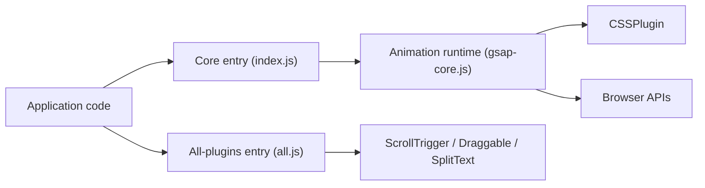

# greensock/GSAP

> Bibliothèque JavaScript d'animation sans dépendance pour développeurs front-end, du CSS au SVG et au canvas.

## Le problème
Animer des propriétés au fil du temps de façon cohérente entre navigateurs, avec séquençage et scroll, est laborieux à la main.

## Ce que ça fait vraiment
Le noyau (`gsap-core.js`) gère tweens, timelines, easings et un ticker qui met à jour les propriétés des cibles ; `CSSPlugin` traduit les valeurs en styles. Des plugins séparés, enregistrés via `gsap.registerPlugin`, ajoutent ScrollTrigger, Draggable, Flip, MorphSVG, SplitText, MotionPath. Le README annonce que tous les plugins sont désormais gratuits, même en usage commercial.

## Comment c'est branché


## Essayer
```bash
npm install gsap
```
```html
<script src="https://cdn.jsdelivr.net/npm/gsap@3.15/dist/gsap.min.js"></script>
```

## Coût et pièges
Gratuit selon le README. Aucune licence n'est détectée dans le catalogue : les conditions d'usage réelles sont à vérifier avant toute intégration commerciale. Enregistrer les plugins avant usage.

## Ce que ce n'est pas
Ce n'est pas un composant React : le hook `useGSAP` est dans un paquet séparé, `@gsap/react`. Le dépôt ne contient pas de service ni de back-end.

## Alternatives
- Aucune alternative nommée dans le README.

## Pour toi
Ignorer : outil d'animation web sans lien avec les données ou l'IA, et licence non déclarée dans le catalogue.

