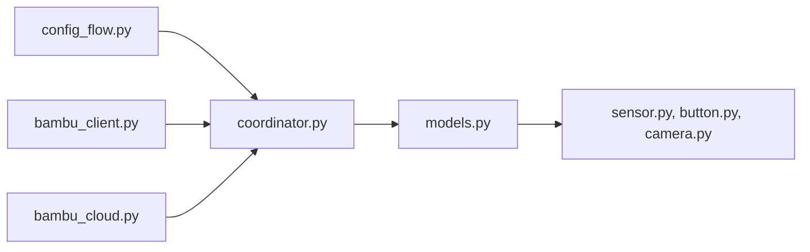

# greghesp/ha-bambulab

> Intégration Home Assistant pour surveiller et piloter les imprimantes 3D Bambu Lab.

## Le problème
Sans intégration, les imprimantes Bambu Lab restent hors de ton domotique Home Assistant.

## Ce que ça fait vraiment
README minimal, tout renvoie à la documentation externe. D'après le code : un flux de configuration, un coordinateur qui met à jour un modèle d'imprimante à partir d'un client local ou du cloud Bambu, et des entités Home Assistant (capteurs, boutons, interrupteurs, caméra, mises à jour, diagnostics), plus des cartes Lovelace.

## Comment c'est branché

## Essayer
Aucune commande documentée dans le README (installation renvoyée vers la doc).

## Coût et pièges
Gratuit ; requiert Home Assistant et une imprimante Bambu Lab. Le mode cloud dépend d'un compte Bambu.

## Ce que ce n'est pas
Pas un outil autonome : sans Home Assistant, rien. Le README ne détaille ni installation ni configuration.

## Alternatives
Aucune alternative nommée dans le README.

## Pour toi
À ignorer : domotique et impression 3D, hors périmètre data/IA/MLOps ; matière du README insuffisante.

