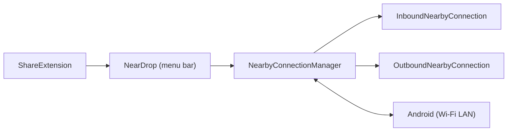

# grishka/NearDrop

> Application macOS en barre de menus qui reçoit et envoie des fichiers avec Quick Share d'Android.

## Le problème
Il n'existe pas de client officiel Quick Share/Nearby Share pour macOS.

## Ce que ça fait vraiment
Implémentation partielle du protocole de Google : la Mac est visible sur le réseau, l'appareil Android envoie via Quick Share, les fichiers sont enregistrés dans Téléchargements. L'envoi se fait par l'extension de partage Finder/Safari. Wi-Fi LAN uniquement ; Bluetooth et Wi-Fi Direct non pris en charge, d'où un QR code sur Android.

## Comment c'est branché


## Essayer
```bash
brew install grishka/grishka/neardrop && sudo xattr -r -d com.apple.quarantine "/Applications/NearDrop.app"
```

## Coût et pièges
Gratuit, mais non notarisé : Gatekeeper demande d'autoriser à la main. L'appareil doit être sur le même réseau local ; visible à tous sur ce réseau tant que l'app tourne.

## Ce que ce n'est pas
Pas un AirDrop pour Android, et implémentation incomplète du protocole.

## Alternatives
Aucune nommée dans le README.

## Pour toi
À surveiller : pratique pour un Mac et un téléphone Android, mais sans intérêt pour un flux de travail data/IA.

