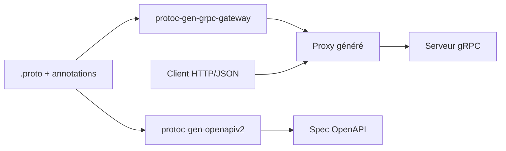

# grpc-ecosystem/grpc-gateway

> Plugin protoc qui génère un proxy REST/JSON devant un service gRPC, pour équipes qui exposent les deux.

## Le problème
Un service gRPC n'est pas consommable facilement par les clients qui attendent du REST/JSON. Écrire et maintenir deux API à la main coûte cher.

## Ce que ça fait vraiment
À partir des annotations `google.api.http` d'un fichier `.proto`, `protoc-gen-grpc-gateway` génère un serveur reverse-proxy en Go qui traduit HTTP/JSON en appels gRPC. Un second plugin, `protoc-gen-openapiv2`, produit la spécification OpenAPI ; `protoc-gen-openapiv3` existe mais est en alpha. Le mapping peut aussi venir d'un fichier de configuration externe.

## Comment c'est branché


## Essayer
```bash
go install \
    github.com/grpc-ecosystem/grpc-gateway/v2/protoc-gen-grpc-gateway \
    github.com/grpc-ecosystem/grpc-gateway/v2/protoc-gen-openapiv2 \
    google.golang.org/protobuf/cmd/protoc-gen-go \
    google.golang.org/grpc/cmd/protoc-gen-go-grpc
buf generate
```

## Coût et pièges
Gratuit. Il faut protoc ou buf et les fichiers googleapis. Garder la même version pour le générateur et le runtime. Les binaires releases ont des signatures SLSA3.

## Ce que ce n'est pas
Ce n'est pas un API gateway (pas d'authentification ni de limitation de débit fournies) : seulement un traducteur de protocole. Le plugin OpenAPI 3.1 n'est pas stable.

## Alternatives
Le README ne cite pas d'autre projet équivalent.

## Pour toi
À surveiller : pertinent si tu sers des modèles ou pipelines via gRPC et veux une façade REST sans double code ; inutile sans gRPC.

