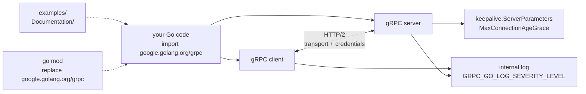

# grpc/grpc-go

> **The Go implementation of gRPC: remote procedure calls over HTTP/2, for Go services.**

## The problem

Making two Go services talk to each other without an RPC framework means re-inventing the
transport, the serialization format, deadlines, authentication, long-lived connection
management and error propagation every single time. Each team writes its own HTTP + JSON
client, and nothing enforces the contract between services.

## What it actually does

The README is short and hands most of the documentation over to `grpc.io`; what it claims on
its own is limited.

- It is **the Go implementation** of gRPC, described as a general, open RPC framework that
  puts mobile and HTTP/2 first.
- You use it by importing the `google.golang.org/grpc` module: no separate install step,
  `go build|run|test` fetches the dependencies.
- It carries both the client and the server side: the README documents server keepalive
  settings (`MaxConnectionAgeGrace`, package `google.golang.org/grpc/keepalive`) and a
  client-side error (`code = Unavailable desc = transport is closing`).
- It ships internal logging driven by environment variables
  (`GRPC_GO_LOG_VERBOSITY_LEVEL`, `GRPC_GO_LOG_SEVERITY_LEVEL`).
- The repository provides an `examples` directory, low-level technical docs under
  `Documentation`, and a published performance benchmark dashboard.

What the README does not document: code generation from `.proto` files, interceptors, load
balancing, service discovery. All of it is deferred to the external guides.

## How it is wired

No code-derived diagram exists for this repository: the graph below is rebuilt from the
README alone, so it only shows what the README names.



## Trying it

The README gives no example program: usage boils down to an import, and everything else points
to the `grpc.io` quick start. The only documented commands are the FAQ ones.

```go
import "google.golang.org/grpc"
```

```bash
# update to the latest version
go get -u google.golang.org/grpc

# from a network where golang.org is blocked (China): alias to the GitHub path
go mod edit -replace=google.golang.org/grpc=github.com/grpc/grpc-go@latest
go mod tidy
go mod vendor
go build -mod=vendor

# turn everything on, on both sides
export GRPC_GO_LOG_VERBOSITY_LEVEL=99
export GRPC_GO_LOG_SEVERITY_LEVEL=info
```

## Cost and gotchas

- **Free, no account, no API key**: no third-party service, no quota, no bill. The README
  mentions no telemetry.
- **Narrow Go version window**: the README requires "any one of the **two latest major**"
  Go releases. A toolchain pinned further back is out of spec.
- **`go get` may fail depending on the network**: `golang.org` is blocked in some countries,
  hence the documented I/O timeout. The `go mod edit -replace` workaround must be repeated
  **for every transitive dependency** hosted on golang.org.
- **`transport is closing`** is the recurring error the README calls out: mis-configured
  transport credentials, bytes disrupted by a proxy, server shutdown, or keepalive parameters
  cutting connections. The symptom is on the client, the cause on the server — log **both**
  sides to find it.
- **`undefined: grpc.SupportPackageIsVersion`** means the module is too old; update it.

## What it is not

- **It is not gRPC itself, nor a specification**: it is one implementation among several
  languages. The protocol, the `.proto` format and the guides live at `grpc.io`.
- **It is not a web API framework**: no HTTP routing, no REST, no rendering. You expose typed
  methods between services, not endpoints for a browser — a browser client needs an extra
  bridge, which this README does not cover.
- **It is not a self-documenting repository**: the README stops at prerequisites, the import
  line and a troubleshooting FAQ. All learning happens in the external docs, which is why this
  sheet carries the "insufficient material" flag.

## Alternatives

| | When to prefer it |
|---|---|
| **go-kratos/kratos** | A full Go microservice framework (config, logging, discovery, project layout) that builds on transports such as gRPC. Prefer it when you want a whole service skeleton; prefer grpc-go when you only want the RPC layer. |
| **zeromicro/go-zero** | Same idea of an opinionated Go framework, with code generation and operational guardrails. Prefer it to stand up a complete service quickly rather than assembling one yourself. |
| **TykTechnologies/tyk** | An API gateway: it sits *in front of* services, gRPC included, for authentication and quotas. Not a replacement, a complement. |

None of these three catalogue neighbours is a direct substitute: none implements gRPC in Go,
they use it or surround it. No strictly comparable alternative in the catalogue.

## For you

Adopt it as soon as an inference service or a pipeline has to be called by other services with
a typed contract and streaming — it is the transport many model servers assume, and being able
to read a `transport is closing` error saves hours. Skip it when the caller is a browser or a
notebook: a plain HTTP API stays easier to expose and debug there.
