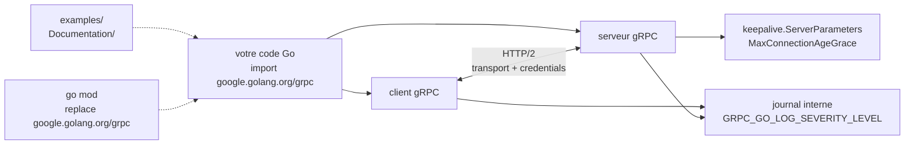

# grpc/grpc-go

> **L'implémentation Go de gRPC : appels de procédure distante sur HTTP/2, pour services Go.**

## Le problème

Faire dialoguer deux services en Go sans cadre d'appel distant oblige à réinventer à chaque
fois le transport, le format de sérialisation, les délais d'attente, l'authentification, la
gestion des connexions persistantes et la propagation des erreurs. Chaque équipe recode sa
variante d'un client HTTP + JSON, et les contrats entre services ne sont vérifiés nulle part.

## Ce que ça fait vraiment

Le README est court et délègue l'essentiel de la documentation à `grpc.io` ; ce qu'il affirme
en propre tient en peu de lignes.

- C'est **l'implémentation Go** du cadre gRPC, décrit comme un cadre d'appel distant général,
  ouvert, orienté mobile et HTTP/2 d'abord.
- Elle s'utilise en important le module `google.golang.org/grpc` dans son code : aucune étape
  d'installation séparée, `go build|run|test` récupère les dépendances.
- Elle porte à la fois le côté client et le côté serveur : le README documente des paramètres
  serveur de type *keepalive* (`MaxConnectionAgeGrace`, paquet `google.golang.org/grpc/keepalive`)
  et des erreurs vues côté client (`code = Unavailable desc = transport is closing`).
- Elle embarque une journalisation interne pilotée par variables d'environnement
  (`GRPC_GO_LOG_VERBOSITY_LEVEL`, `GRPC_GO_LOG_SEVERITY_LEVEL`).
- Le dépôt fournit un répertoire `examples`, des documents techniques de bas niveau dans
  `Documentation`, et un tableau de bord de mesures de performance publié en ligne.

Ce que le README ne documente pas : la génération de code depuis les fichiers `.proto`,
les intercepteurs, l'équilibrage de charge, la découverte de services. Tout cela est renvoyé
vers les guides externes.

## Comment c'est branché

Aucun diagramme tiré du code n'existe pour ce dépôt : ce schéma est reconstruit depuis le seul
README, et ne montre donc que ce qu'il nomme.



## Essayer

Le README ne donne pas de programme d'exemple : l'usage se réduit à un import, et le reste
renvoie au *quick start* de `grpc.io`. Les seules commandes documentées sont celles de la FAQ.

```go
import "google.golang.org/grpc"
```

```bash
# mise à jour vers la dernière version
go get -u google.golang.org/grpc

# depuis un réseau où golang.org est bloqué (Chine) : passer par l'alias GitHub
go mod edit -replace=google.golang.org/grpc=github.com/grpc/grpc-go@latest
go mod tidy
go mod vendor
go build -mod=vendor

# tout journaliser, des deux côtés
export GRPC_GO_LOG_VERBOSITY_LEVEL=99
export GRPC_GO_LOG_SEVERITY_LEVEL=info
```

## Coût et pièges

- **Gratuit, sans compte ni clé d'API** : pas de service tiers, pas de quota, pas de
  facturation. Rien dans le README ne mentionne de télémétrie.
- **Fenêtre de versions Go étroite** : le README exige « l'une des **deux dernières versions
  majeures** » de Go. Un environnement figé sur une version plus ancienne est hors spécification.
- **`go get` peut échouer selon le réseau** : le domaine `golang.org` est bloqué dans certains
  pays, d'où l'erreur d'expiration d'E/S documentée. Le contournement par `go mod edit -replace`
  doit être répété **pour toutes les dépendances transitives** hébergées sur golang.org.
- **`transport is closing`** est l'erreur récurrente signalée par le README : identifiants de
  transport mal configurés, octets altérés par un mandataire, arrêt du serveur, ou paramètres
  *keepalive* qui coupent les connexions. Le symptôme est côté client, la cause côté serveur —
  il faut journaliser des **deux** côtés pour la trouver.
- **`undefined: grpc.SupportPackageIsVersion`** signale une version trop ancienne du module, à
  corriger par une mise à jour.

## Ce que ce n'est pas

- **Ce n'est pas gRPC lui-même, ni une spécification** : c'est une implémentation parmi
  d'autres langages. Le protocole, le format `.proto` et les guides vivent ailleurs (`grpc.io`).
- **Ce n'est pas un cadre d'API web** : pas de routage HTTP, pas de REST, pas de rendu. On
  expose des méthodes typées entre services, pas des points d'entrée pour un navigateur — un
  client web a besoin d'un pont supplémentaire, non documenté ici.
- **Ce n'est pas un dépôt qui s'auto-documente** : le README se limite aux prérequis, à
  l'import et à une FAQ de dépannage. Tout l'apprentissage se fait sur la documentation
  externe, ce qui est la raison de l'alerte « matière insuffisante » portée sur cette fiche.

## Alternatives

| | Quand le préférer |
|---|---|
| **go-kratos/kratos** | Cadre de microservices Go complet (configuration, journalisation, découverte, mise en page du projet) qui s'appuie sur des transports comme gRPC. À préférer quand on veut une charpente de service entière ; grpc-go quand on veut seulement la couche d'appel distant. |
| **zeromicro/go-zero** | Même logique de cadre Go opinioné, avec génération de code et garde-fous d'exploitation. À préférer pour démarrer vite un service complet plutôt que d'assembler soi-même. |
| **TykTechnologies/tyk** | Passerelle d'API : elle se place *devant* des services, y compris gRPC, pour l'authentification et les quotas. Ce n'est pas un remplaçant mais un complément. |

Ces trois voisins du catalogue ne sont pas des substituts directs : aucun n'implémente gRPC en
Go, ils l'utilisent ou l'entourent. Aucune alternative strictement comparable dans le catalogue.

## Pour toi

À adopter dès qu'un service d'inférence ou un pipeline doit être appelé par d'autres services
avec un contrat typé et des flux en continu — c'est le transport que supposent beaucoup de
serveurs de modèles, et savoir lire une erreur `transport is closing` fait gagner des heures.
À ne pas choisir si l'appelant est un navigateur ou un notebook : dans ce cas, une API HTTP
ordinaire reste plus simple à exposer et à déboguer.
