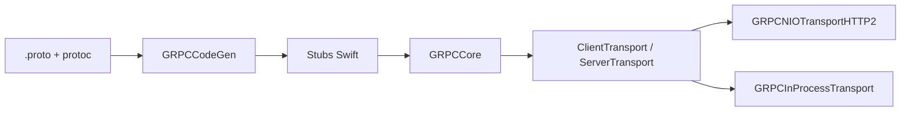

# grpc/grpc-swift-2

> Implémentation gRPC pour Swift, version 2, à composer avec un transport et SwiftProtobuf.

## Le problème
Appeler ou exposer des services gRPC depuis Swift demande un runtime, un générateur de stubs et un transport.

## Ce que ça fait vraiment
Fournit `GRPCCore` (appels client et serveur, intercepteurs, streaming, compression, configs de méthode), un plugin de génération de code depuis les `.proto`, un transport en mémoire (`GRPCInProcessTransport`) pour les tests et l'outil `grpc-dev-tool`. Le transport HTTP/2 et l'intégration Protobuf sont dans des dépôts séparés.

## Comment c'est branché


## Essayer
```bash
# Package.swift (swift-tools-version: 6.1, macOS 15)
.package(url: "https://github.com/grpc/grpc-swift-2.git", from: "2.0.0"),
.package(url: "https://github.com/grpc/grpc-swift-nio-transport.git", from: "2.0.0"),
.package(url: "https://github.com/grpc/grpc-swift-protobuf.git", from: "2.0.0"),
```

## Coût et pièges
Gratuit. Swift 6.1 et macOS 15 requis dans l'exemple ; trois paquets à combiner.

## Ce que ce n'est pas
Pas un paquet autonome : sans transport NIO et SwiftProtobuf, rien ne circule sur le réseau.

## Alternatives
- grpc-swift-nio-transport : transport HTTP/2 nécessaire.
- grpc-swift-protobuf : intégration Protobuf.
- grpc-swift-extras : compléments optionnels.

## Pour toi
Ignorer : réservé aux développeurs Swift ; pour du gRPC côté modèle ou service, le dépôt `grpc/grpc` du projet est plus pertinent.

