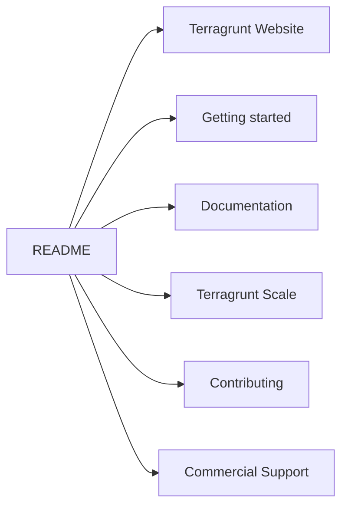

# gruntwork-io/terragrunt

> Orchestrateur pour faire passer à l'échelle une infrastructure écrite en OpenTofu ou Terraform.

## Le problème
Non détaillé dans ce README : il indique seulement que l'infrastructure comme code écrite en
OpenTofu/Terraform a besoin d'un outil pour passer à l'échelle.

## Ce que ça fait vraiment
Le README ne décrit pas le fonctionnement. Il se présente comme un outil d'orchestration flexible
permettant à l'IaC OpenTofu/Terraform de passer à l'échelle, et renvoie vers six ressources externes :
le site du projet, un guide de démarrage, la documentation, une page « Terragrunt Scale », le guide de
contribution et une offre de support commercial. Aucune fonctionnalité, commande ou architecture
n'est documentée ici.

## Comment c'est branché

## Essayer
Aucune commande documentée dans ce README ; l'installation est renvoyée vers le site du projet.

## Coût et pièges
Non documenté ici. Seul indice : une offre de **support commercial** est proposée, ce qui suggère un
modèle ouvert adossé à des services payants.

## Ce que ce n'est pas
Ce README ne permet pas de le dire : ni périmètre, ni limites, ni licence, ni prérequis.
Il ne remplace pas OpenTofu/Terraform, qu'il orchestre — c'est la seule limite déductible du texte.
Matière très insuffisante pour trancher.

## Alternatives
Aucun dépôt alternatif n'est nommé dans le README.

## Pour toi
Outil connu côté infra, mais rien dans ce README ne permet de l'évaluer : passer par le site du projet.
