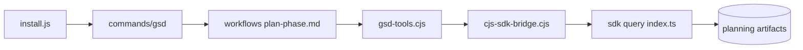

# gsd-build/get-shit-done

> Ancien dépôt de GSD, système de planification et d'exécution par fichiers pour agents de code.

## Le problème
Non documenté dans le README, qui se limite à une redirection.

## Ce que ça fait vraiment
Le README dit seulement que le projet a déménagé vers GSD Core. D'après l'architecture fournie : des commandes slash (`commands/gsd/`) renvoient vers des workflows Markdown (plan-phase, execute-phase, verify-work), appuyés par un CLI Node (`gsd-tools.cjs`) et un SDK TypeScript qui lit et modifie un espace de planification local (roadmap, phases, décisions). L'installeur (`install.js`) pose commandes, hooks et agents pour Claude, Codex, Gemini, OpenCode.

## Comment c'est branché

## Essayer
Aucune commande documentée dans le README.

## Coût et pièges
Rien d'indiqué dans le README. Dépôt archivé.

## Ce que ce n'est pas
Pas la version active : les sources, issues et versions à jour sont ailleurs.

## Alternatives
- open-gsd/gsd-core — la suite du projet, désignée par le README.

## Pour toi
À ignorer ; si le concept t'intéresse, va voir open-gsd/gsd-core.
