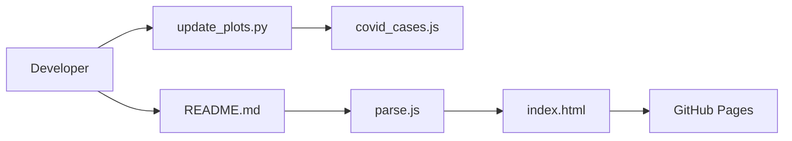

# gto76/python-cheatsheet

> Aide-mémoire Python très dense, de la syntaxe de base à NumPy, Pandas et Plotly.

## Le problème
Retrouver vite la bonne syntaxe ou la bonne bibliothèque sans relire plusieurs documentations.

## Ce que ça fait vraiment
Le README est la fiche elle-même : collections, types, syntaxe, fichiers, formats (JSON, CSV, SQLite), threads, asyncio, puis paquets (NumPy, Pandas, Plotly, Pygame, Flask). Chaque bloc de code est commenté sur la ligne. Une page web (`index.html` + `parse.js`) lit le `README.md` dans le navigateur ; des scripts Python produisent les données des graphiques.

## Comment c'est branché


## Essayer
```bash
# Aucune installation : lire le README ou la page web.
# Les exemples demandent leurs paquets, par exemple :
# pip3 install numpy
# pip3 install pandas matplotlib
# pip3 install plotly kaleido pandas
```

## Coût et pièges
Gratuit. Certains exemples (Selenium, scraping Yahoo Finance, jeu de données Covid distant) dépendent de sites externes qui peuvent changer.

## Ce que ce n'est pas
Pas un cours : il suppose que tu connais déjà les notions. Le catalogue n'indique aucune licence : la réutilisation du texte n'est pas cadrée.

## Alternatives
Aucune alternative nommée dans le README.

## Pour toi
À adopter comme référence de bureau pour un profil data : les sections NumPy, Pandas et Plotly sont directement utiles ; vérifie juste la licence avant de recopier du contenu.

