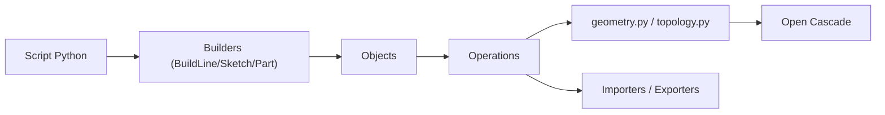

# gumyr/build123d

> Framework Python de modélisation CAO 2D et 3D paramétrique, basé sur Open Cascade.

## Le problème
Dessiner des pièces pour l'impression 3D ou l'usinage à la souris se versionne mal et se paramètre difficilement.

## Ce que ça fait vraiment
On écrit la géométrie en Python, en mode algèbre (`part += ...`) ou en mode Builder avec contextes `BuildLine`, `BuildSketch`, `BuildPart`. Des sélecteurs filtrent arêtes et faces, et on peut sous-classer les objets. L'import et l'export couvrent STEP, STL et SVG. Le projet est dérivé de CadQuery.

## Comment c'est branché


## Essayer
```bash
pip install build123d
pip install --upgrade pip
pip install git+https://github.com/gumyr/build123d
```

## Coût et pièges
Gratuit. Un visualiseur comme ocp_vscode est recommandé. Environ 328 issues ouvertes.

## Ce que ce n'est pas
Pas un logiciel CAO graphique. Pas un outil de simulation.

## Alternatives
- CadQuery : projet dont build123d est dérivé, avant refonte.

## Pour toi
À surveiller si tu génères des pièces par code ou des jeux de données 3D : bonne approche « CAD-as-code », hors cœur de métier data/IA.

