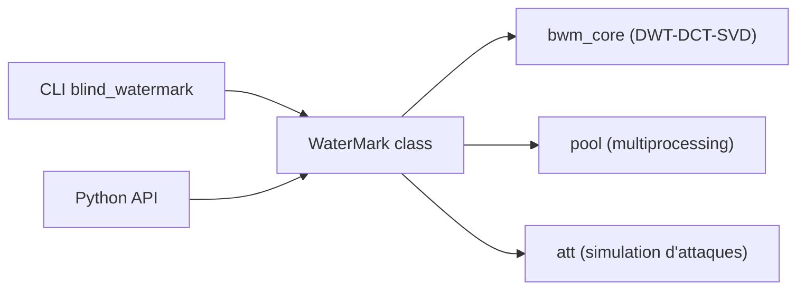

# guofei9987/blind_watermark

> Bibliothèque Python qui cache un texte ou une image dans une image par DWT-DCT-SVD, sans original pour l'extraire.

## Le problème
Marquer une image de façon invisible pour prouver sa provenance, avec un tatouage qui survit à des retouches.

## Ce que ça fait vraiment
La classe `WaterMark` lit une image et un marquage (texte, image ou tableau de bits), les mélange par transformées DWT-DCT-SVD (`bwm_core.py`) avec deux mots de passe, puis extrait le marquage d'une image tatouée. Le README montre une extraction réussie après rotation, recadrage aléatoire, masques, redimensionnement, bruit ou baisse de luminosité. Un traitement en parallèle est disponible (`processes`).

## Comment c'est branché


## Essayer
```bash
pip install blind-watermark
blind_watermark --embed --pwd 1234 examples/pic/ori_img.jpeg "watermark text" examples/output/embedded.png
blind_watermark --extract --pwd 1234 --wm_shape 111 examples/output/embedded.png
```

## Coût et pièges
Gratuit. La forme du marquage (`wm_shape`) doit être connue à l'extraction. Pour les bits, la sortie est un tableau de flottants à seuiller (par exemple 0,5). Aucun chiffre de robustesse au-delà des exemples visuels du README.

## Ce que ce n'est pas
Pas un système de protection du droit d'auteur juridiquement éprouvé, et pas un tatouage de sorties de modèles génératifs : il travaille sur des images déjà produites.

## Alternatives
Le README cite `text_blind_watermark` (message dans du texte) et `HideInfo` (cacher dans image, son ou texte), du même auteur.

## Pour toi
Surveiller : utile pour tatouer des jeux d'images ou des sorties, mais maintenu par une seule personne et sans évaluation chiffrée de sa robustesse ; tester avant de t'y fier.

