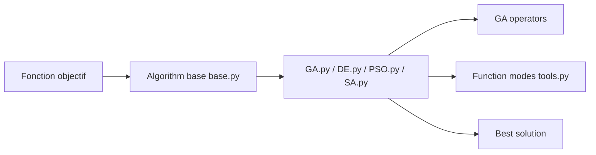

# guofei9987/scikit-opt

> Bibliothèque Python d'optimisation par intelligence en essaim : génétique, PSO, recuit, colonies de fourmis, etc.

## Le problème
Optimiser une fonction non convexe ou un TSP sans écrire soi-même les métaheuristiques.

## Ce que ça fait vraiment
Fournit GA, DE, PSO, SA, ACA, algorithme immunitaire et AFSA, avec contraintes d'égalité et d'inégalité. Opérateurs GA remplaçables (UDF), reprise d'un run (`run(10)` puis `run(20)`) et quatre modes d'accélération (vectorisation, threads, processus, cache). Le GPU est annoncé en développement.

## Comment c'est branché


## Essayer
```bash
pip install scikit-opt
```
```python
from sko.GA import GA
ga = GA(func=schaffer, n_dim=2, size_pop=50, max_iter=800, prob_mut=0.001, lb=[-1, -1], ub=[1, 1], precision=1e-7)
best_x, best_y = ga.run()
```

## Coût et pièges
Gratuit. Dernier push en mars 2026. Les métaheuristiques n'offrent pas de garantie d'optimum global.

## Ce que ce n'est pas
Pas un solveur exact (programmation linéaire, etc.) ni un outil d'optimisation d'hyperparamètres dédié.

## Alternatives
Aucune alternative nommée dans le README.

## Pour toi
À surveiller : pratique pour de l'optimisation heuristique ou pédagogique, mais d'autres outils couvrent mieux le réglage d'hyperparamètres.

