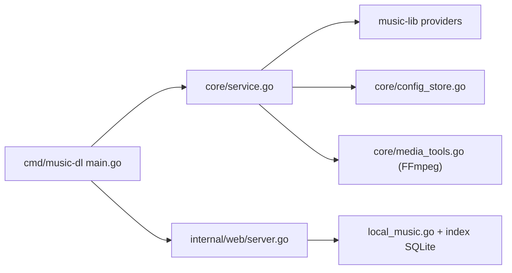

# guohuiyuan/go-music-dl

> Outil de recherche et de téléchargement de musique multi-plateformes chinoises, en interface web, terminal ou application native.

## Le problème
Chercher, écouter et télécharger de la musique répartie sur de nombreux services (NetEase, QQ, Kugou, Bilibili…) depuis un point d'entrée unique.

## Ce que ça fait vraiment
Un binaire Go avec CLI/TUI (Cobra, Bubble Tea) et un serveur web Gin. Une couche `core` appelle la bibliothèque externe `music-lib` pour chaque fournisseur. Il gère playlists locales (SQLite), cookies et connexion par QR code, bibliothèque locale indexée, remplacement de source, paroles mot à mot. Hôtes : Rust (Tao/Wry) pour le bureau, Go/Gio pour Android et iOS.

## Comment c'est branché


## Essayer
```bash
./music-dl web
./music-dl -k "周杰伦"
docker compose up -d --remove-orphans
```
Le README impose de créer d'abord le dossier `data` (`mkdir -p data && chmod 777 data`).

## Coût et pièges
Gratuit, mais dépend d'API tierces qui changent : le README admet des sites qui cessent de fonctionner. FFmpeg optionnel. Les cookies sont stockés en local. Licence AGPL-3.0.

## Ce que ce n'est pas
Pas un service légal : le README dit « à usage d'étude » et demande de supprimer les fichiers téléchargés sous 24 heures. Le contenu payant est filtré, mais la conformité aux plateformes reste à votre charge.

## Alternatives
- 0xHJK/music-dl et CharlesPikachu/musicdl : bibliothèques de téléchargement dont il s'inspire.
- metowolf/Meting : référence pour l'agrégation multi-plateformes.

## Pour toi
À ignorer : aucun lien avec la data ou l'IA, dépendance à des plateformes chinoises fragiles et statut légal des téléchargements douteux.

