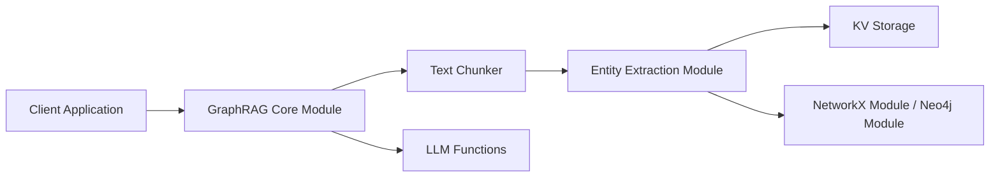

# gusye1234/nano-graphrag

> Implémentation courte (environ 1100 lignes) de GraphRAG, lisible et modifiable, pour ingénieurs RAG.

## Le problème
L'implémentation officielle de GraphRAG est difficile à lire et à adapter, ce qui freine l'expérimentation.

## Ce que ça fait vraiment
`GraphRAG` découpe le texte, extrait entités et relations par LLM, calcule les communautés du graphe, produit des rapports de communauté, puis répond en mode global, local ou naïf. Les composants sont interchangeables : LLM (OpenAI, Bedrock, DeepSeek, Ollama), embeddings, base vectorielle (`nano-vectordb`, `hnswlib`, Milvus Lite, Faiss), graphe (`networkx` ou Neo4j). L'insertion est incrémentale (hachage MD5 des contenus) et chaque méthode a son pendant asynchrone.

## Comment c'est branché


## Essayer
```bash
pip install nano-graphrag
export OPENAI_API_KEY="sk-..."
curl https://raw.githubusercontent.com/gusye1234/nano-graphrag/main/tests/mock_data.txt > ./book.txt
```
Ensuite, `GraphRAG(working_dir="./dickens")`, `insert(...)` et `query(...)` en Python.

## Coût et pièges
Deux modèles sont requis : un « grand » (`gpt-4o` par défaut) et un « petit » (`gpt-4o-mini`). À chaque insertion, les communautés sont recalculées et les rapports régénérés, avec le coût LLM correspondant. Sans clé, le README renvoie à un exemple Ollama et Transformers.

## Ce que ce n'est pas
Ce n'est pas une copie fidèle : la fonction « covariables » n'est pas implémentée et la recherche globale n'utilise que les 512 communautés les plus importantes par défaut. Le README annonce des benchmarks sans en donner les chiffres.

## Alternatives
- memobase : pour une mémoire utilisateur multi-utilisateurs à long terme, citée par le README.
- LightRAG : projet qui réutilise nano-graphrag, avec plus de fonctions.
- fast-graphrag : RAG qui s'adapte aux données et aux requêtes, cité de la même façon.

## Pour toi
À adopter pour comprendre ou prototyper un RAG à graphe : le code est court et les briques sont remplaçables ; pour un service multi-utilisateurs, regarde plutôt les alternatives.
