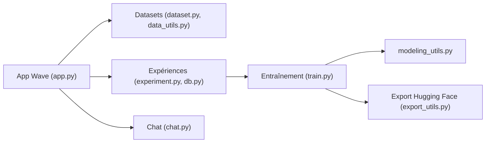

# h2oai/h2o-llmstudio

> Interface graphique et CLI pour affiner des LLM sans coder, pour praticiens de l'IA disposant d'un GPU NVIDIA.

## Le problème
Le fine-tuning de LLM demande scripts, hyperparamètres et suivi d'expériences ; peu de gens veulent tout câbler.

## Ce que ça fait vraiment
Une application H2O Wave gère projets, jeux de données et expériences. Elle entraîne avec LoRA et quantification 8 bits, DPO/IPO/KTO (RLHF retiré), régression et classification causales, avec DeepSpeed sur plusieurs GPU. Évaluation par métriques et par juge, comparaison visuelle, intégration W&B, chat avec le modèle, export vers Hugging Face. Le même pipeline s'utilise en CLI avec un YAML.

## Comment c'est branché


## Essayer
```bash
make setup
make llmstudio
uv run python llm_studio/train.py -Y {path_to_config_yaml_file}
```

## Coût et pièges
GPU NVIDIA (24 Go de mémoire conseillés pour les gros modèles), Ubuntu 16.04+, pilotes ≥ 470.57.02 ; DeepSpeed demande CUDA Toolkit et NVLink. Compatibilité arrière non garantie entre versions : fige la version.

## Ce que ce n'est pas
Pas une plateforme d'inférence ni de déploiement. « Sans code » ne dispense pas de bien préparer les données (format décrit dans la doc).

## Alternatives
Non documenté dans le README : aucune alternative nommée.

## Pour toi
Utile pour prototyper un fine-tuning LoRA avec interface visuelle si tu as un GPU ; si tu écris déjà tes boucles d'entraînement, l'intérêt est moindre.

