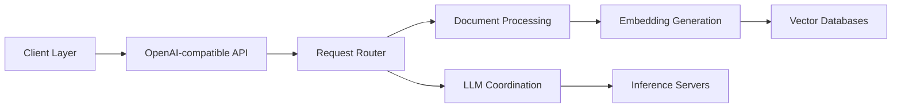

# h2oai/h2ogpt

> Interface de chat et de Q/R documentaire avec LLM locaux ou distants, désormais archivée.

## Le problème
Interroger ses documents avec un LLM sans les envoyer à un service cloud demande d'assembler ingestion, embeddings, base vectorielle et UI.

## Ce que ça fait vraiment
Ingestion de PDF, Office, images, audio, vidéo, code dans Chroma, Weaviate ou FAISS ; HYDE, découpage sémantique.
UI Gradio ou CLI, multi-modèles (HF, llama.cpp, GPT4ALL, vLLM, TGI, Ollama, APIs commerciales).
Serveur proxy compatible OpenAI (chat, embeddings, STT/TTS, images, appels de fonctions), agents recherche/code/CSV.
Vision, génération d'images, voix, authentification.

## Comment c'est branché


## Essayer
```bash
GPT_H2O_AI=0 CONCURRENCY_COUNT=1 pytest --instafail -s -v tests
```
Seules les commandes de tests figurent dans le README ; l'installation renvoie à des docs séparées.

## Coût et pièges
Gratuit ; GPU recommandé, Docker conseillé pour toutes les fonctions.
Dépôt archivé : plus de correctifs.

## Ce que ce n'est pas
Plus un projet vivant ; la version entreprise h2oGPTe est un produit distinct.
Nombreuses dépendances lourdes.

## Alternatives
- pseudotensor/open-strawberry : projet CoT cité par le README, sans rapport direct.

## Pour toi
À ignorer : archivé, donc à ne pas adopter pour un RAG local ; reste une mine d'idées (HYDE, proxy OpenAI) à relire.
