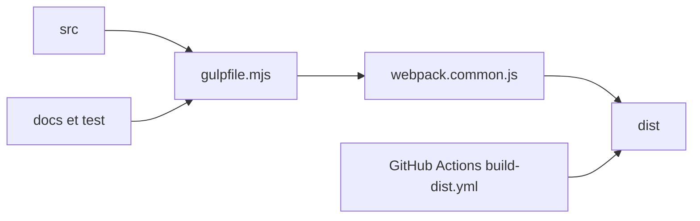

# h5bp/html5-boilerplate

> Gabarit de départ front-end pour sites et applications web, sans imposer de framework.

## Le problème
Démarrer un site avec les bons fichiers de base (HTML, CSS, 404, robots, manifeste) demande de recréer la même structure à chaque fois.

## Ce que ça fait vraiment
Le dépôt sert à fabriquer le gabarit : le livrable est le dossier `dist/` (index.html, 404.html, css/style.css, js/app.js, images, robots.txt, site.webmanifest). Il fournit des classes CSS utilitaires, des styles d'impression, des balises Open Graph et un exemple de `package.json`. La construction utilise Gulp et Webpack ; la CI publie sur npm.

## Comment c'est branché


## Essayer
```bash
npx create-html5-boilerplate new-site
cd new-site
npm install
npm run start
```

## Coût et pièges
Gratuit. Ne pas cloner ce dépôt pour démarrer un site : le README recommande le script npx, le dépôt modèle ou le paquet npm.

## Ce que ce n'est pas
Ce n'est pas un framework ni un système de composants.

## Alternatives
Aucune alternative nommée dans le README.

## Pour toi
Ignorer : gabarit front-end, sans lien avec tes chaînes de données ou d'IA.

