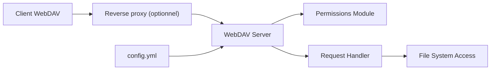

# hacdias/webdav

> Serveur WebDAV autonome en Go, configurable en YAML, JSON ou TOML, pour servir des dossiers avec droits par utilisateur.

## Le problème
Exposer un dossier en WebDAV (sauvegardes, synchronisation) sans monter un serveur web complet.

## Ce que ça fait vraiment
Un binaire unique qui lit un fichier de configuration : répertoire servi (un ou plusieurs), utilisateurs (mot de passe en clair, bcrypt ou variable d'environnement), permissions CRUD par défaut et par utilisateur, règles par chemin ou regex, CORS, TLS direct, journaux console ou JSON. Un exemple fail2ban est fourni.

## Comment c'est branché


## Essayer
```bash
go install github.com/hacdias/webdav/v5@latest
webdav --help
docker run -p 6065:6065 -v ./config.yml:/config.yml:ro -v ./data:/data ghcr.io/hacdias/webdav -c /config.yml
```

## Coût et pièges
Gratuit. L'exemple de configuration contient admin/admin : à changer. Sans utilisateur déclaré, il n'y a pas d'authentification. Derrière un proxy, il faut réécrire l'en-tête Destination pour COPY/MOVE, sinon erreurs 502 ; sous un sous-chemin, régler `prefix`.

## Ce que ce n'est pas
Pas une plateforme de partage de fichiers avec interface web : c'est un serveur de protocole. Pas de gestion de comptes autre que le fichier de configuration.

## Alternatives
Aucune alternative nommée dans le README (Caddy, Nginx, Apache n'y figurent que comme proxys).

## Pour toi
À adopter si tu as besoin d'un partage WebDAV léger (sauvegardes, notes, artefacts) : un binaire, une config, des droits fins.

