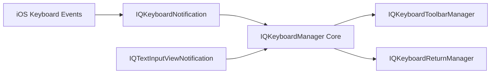

# hackiftekhar/IQKeyboardManager

> Bibliothèque iOS qui empêche le clavier de masquer les champs de saisie, pour développeurs d'apps iPhone.

## Le problème
Sur iOS, le clavier recouvre souvent un `UITextField` ou `UITextView` et il faut écrire du code de défilement à la main.

## Ce que ça fait vraiment
Le module Swift fait remonter automatiquement la vue quand le clavier apparaît, gère les scroll views, tableaux et collections, toutes les orientations. En option (subspecs) : barre d'outils Précédent/Suivant/OK, gestion de la touche retour, résignation au toucher, apparence du clavier, `UITextView` avec placeholder. La version Objective-C a déménagé dans un autre dépôt.

## Comment c'est branché


## Essayer
```bash
pod 'IQKeyboardManagerSwift'
```
```swift
IQKeyboardManager.shared.isEnabled = true
```

## Coût et pièges
iOS 13+, Xcode 13+. L'installation par le code source n'est plus supportée depuis la 7.2.0. À ne pas embarquer dans une bibliothèque tierce (mise en garde de l'auteur).

## Ce que ce n'est pas
Ce n'est pas une bibliothèque pour SDK : l'auteur déconseille de la livrer comme dépendance. Ce n'est pas du code multiplateforme.

## Alternatives
Aucune alternative nommée dans le README.

## Pour toi
À ignorer : outil de développement iOS sans lien avec un profil data/IA/MLOps, malgré sa qualité.

